# AIToBox周刊：20260614

这里记录每周值得分享的AI科技内容，周末发布。

本杂志开源（GitHub: [aitobox/newsweekly](https://github.com/aitobox/newsweekly)），欢迎提交 issue，投稿或推荐你的项目。

> **统计周期**: 2026-06-07 ~ 2026-06-14 | **共收录优质资讯**：30 篇

## AI资讯

#### 1. Dangerous Technology For Americans Only

> （摘要生成失败，请查看原文）

**资讯地址**

https://lucumr.pocoo.org/2026/6/13/americans-only/

#### 2. Premium: The Silicon Valley Bubble (Part 1)

OpenAI 与 Anthropic 等头部 AI 公司正面临严峻的财务压力，其高昂的运营成本与不明朗的盈利路径，正迫使这些企业加速寻求通过公开市场融资以维持生存。

**详细内容** 
* **财务困境与 IPO 压力**：OpenAI 预计在未来一年内寻求上市，核心驱动力在于其极高的资本支出（未来四年需约 8650 亿美元）以及对大规模算力基础设施（如俄亥俄州数据中心）的持续投入，公开市场已成为其维持运营的必要资金渠道。
* **Anthropic 的债务结构风险**：Anthropic 正通过 Apollo 和 Blackstone 筹集 350 亿美元的债务融资，用于购买 Google 的 TPU 芯片。该交易通过特殊目的载体（SPV）进行，且大部分债务由 Broadcom 提供担保，这种复杂的表外融资结构引发了市场对其真实财务状况及信用能力的质疑。
* **信息披露透明度缺失**：Anthropic 在融资过程中被曝出拒绝向潜在债权人提供详细财务数据，仅依赖非 GAAP 标准的投资者演示文稿，这种违背常规借贷标准的行为加剧了市场对其经营风险的担忧。
* **技术愿景与现实的脱节**：文章指出，AI 公司常以“递归自我改进”等理论概念作为愿景，试图掩盖当前商业模式在经济逻辑上的不合理性，并将此作为推迟或调整 IPO 节奏的叙事工具。

亮点：文章揭示了当前 AI 行业繁荣背后的“泡沫”本质，即头部 AI 公司正通过复杂的金融工程和高杠杆债务来掩盖其无法自我造血的现实，将风险转嫁给公开市场投资者与供应链合作伙伴。

**资讯地址**

https://www.wheresyoured.at/premium-the-silicon-valley-bubble-part-1/

#### 3. Claude Fable is relentlessly proactive

> （摘要生成失败，请查看原文）

**资讯地址**

https://simonwillison.net/2026/Jun/11/fable-is-relentlessly-proactive/#atom-everything

#### 4. Formally proving a calculation with Claude and Lean

> （摘要生成失败，请查看原文）

**资讯地址**

https://www.johndcook.com/blog/2026/06/10/claude-and-lean/

#### 5. Breaking news, and how the end might begin

AI 领域专家 Gary Marcus 在与金融专家 Steve Eisman 的对话中指出，OpenAI 可能因财务压力、信任危机及市场竞争加剧，成为引发当前 AI 泡沫破裂的“多米诺骨牌”。

**详细内容**
*   **财务困境与融资压力：** OpenAI 目前面临严重的资金消耗问题，且缺乏像 Google 那样的深厚财力支撑。为了维持运营，OpenAI 被指在融资中向投资者做出越来越多的让步（如承诺高额回报），这种激进的融资行为被质疑具有不可持续性。
*   **信任危机与市场份额流失：** 随着管理层信任度下降及竞争对手（如 Anthropic 和 Google）的崛起，OpenAI 在商业市场中的领先地位已受到严重挑战，客户正逐渐转向更具效率和信誉的竞争对手。
*   **系统性风险的传导：** 对话强调，若 OpenAI 因无法履行财务义务而崩溃，其影响将不仅局限于自身，而是会像次贷危机一样，在整个 AI 产业链（包括依赖 AI 支出的云服务商和硬件供应商）引发连锁反应，甚至导致整个行业泡沫破裂。
*   **估值泡沫的荒谬性：** 双方讨论了当前 AI 市场中存在的“虚高”现象，特别是企业通过夸大积压订单（Backlog）等手段推高股价，这种脱离实际盈利能力的估值模式被视为市场见顶的信号。

亮点：文章通过对比 2008 年次贷危机的逻辑，深刻揭示了当前 AI 行业可能存在的“信用崩塌”风险——即当 AI 公司的商业模式无法转化为实际现金流，且投资者不再愿意为其高额亏损买单时，整个 AI 泡沫将面临毁灭性的打击。

**资讯地址**

https://garymarcus.substack.com/p/breaking-news-and-how-the-end-might

#### 6. Initial impressions of Claude Fable 5

Anthropic 推出的 Claude Fable 5 是一款性能强劲的超大规模模型，在知识储备和复杂任务处理能力上表现卓越，但同时也伴随着更高的使用成本和严格的安全审查机制。

**详细内容** 
* **模型定位与差异化：** Claude Fable 5 与 Claude Mythos 5 具备相同的核心能力，但前者内置了更为严格的安全防护机制。Anthropic 为 API 引入了新的触发反馈机制，并支持在触发安全拦截时自动回退至其他模型。
* **技术规格与定价：** 该系列模型拥有 100 万 token 的上下文窗口和 12.8 万 token 的最大输出长度，知识截止日期更新至 2026 年 1 月。定价为 Claude Opus 4.8 的两倍，即输入 10 美元/百万 token，输出 50 美元/百万 token。
* **知识储备能力：** 实测显示，Claude Fable 5 在无需联网搜索的情况下，对开发者个人开源项目历史的检索与整理能力显著优于 Claude Opus 4.8，展现出极高的参数规模与知识密度。
* **生态覆盖：** 该模型已全面接入 Anthropic 的各端产品，包括 Claude.ai 网页端、Claude Code（CLI 及 Web 版）以及 Claude Cowork，订阅用户可限时使用至 6 月 22 日。

亮点：Claude Fable 5 的“知识密度”被视为其模型规模的有力佐证，这种深厚的知识储备不仅体现了模型参数的量级，更预示了其在处理现代编程库及复杂逻辑任务时可能具备的更高效率。

**资讯地址**

https://simonwillison.net/2026/Jun/9/claude-fable-5/#atom-everything

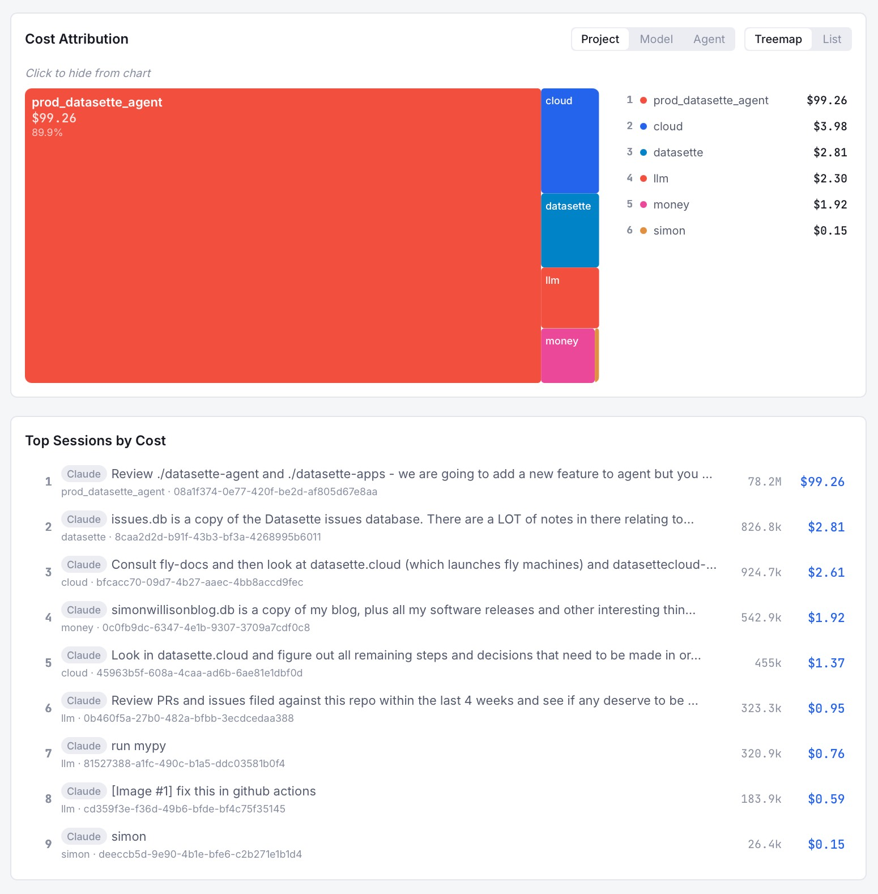

#### 7. AI Is Slowing Down

> （摘要生成失败，请查看原文）

**资讯地址**

https://www.wheresyoured.at/ai-is-slowing-down/

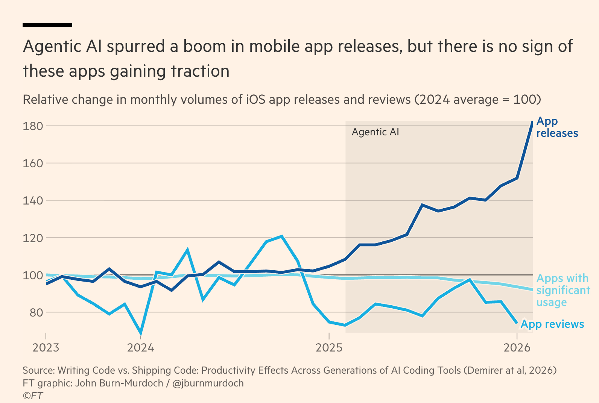

#### 8. xAI is looking more like a datacentre REIT than a frontier lab

> （摘要生成失败，请查看原文）

**资讯地址**

https://martinalderson.com/posts/xais-new-rental-business/

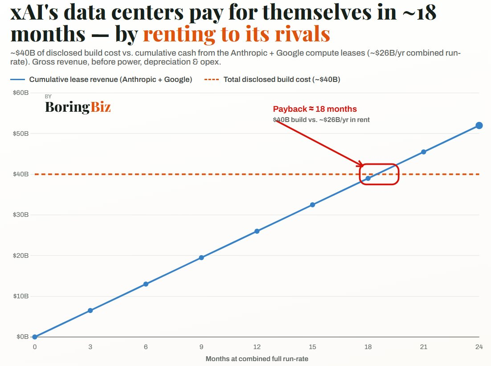

#### 9. Solving a chess puzzle with Claude and Prolog

> （摘要生成失败，请查看原文）

**资讯地址**

https://www.johndcook.com/blog/2026/06/11/prolog-claude/

#### 10. Maybe Section 230 doesn’t shield AI companies from liability, after all

美国《通信规范法》第 230 条款可能无法为 AI 公司提供法律豁免权，因为 AI 生成的内容被视为公司自身的产出而非第三方言论。

**详细内容**

*   **法律适用性的本质区别：** 第 230 条款的核心初衷是保护互联网平台免受第三方用户言论的法律责任。然而，AI 模型生成的错误信息、诽谤或虚假陈述属于模型自身的产出，而非第三方内容，因此该条款可能并不适用于 AI 公司。
*   **德国司法判例的启示：** 德国近期的一项裁决认定公司需对其聊天机器人的错误负责。这一逻辑若被美国法院采纳，将对 OpenAI、Google、Anthropic 等 LLM 提供商构成巨大法律挑战，因为目前 AI 系统普遍存在幻觉和生成有害信息的倾向。
*   **立法层面的博弈：** 尽管 Sam Altman 曾公开表示愿意探讨 AI 监管框架，但其公司近期被指支持旨在豁免 AI 实验室重大社会责任的州法律。与此同时，美国跨党派参议员已提出“Sunset 230”法案，旨在限制第 230 条款的适用范围，尽管该法案目前面临科技巨头强大的游说阻力。
*   **行业责任的倒逼机制：** 若 AI 公司无法通过第 230 条款规避责任，将迫使行业从根本上解决模型“幻觉”问题，从而推动 AI 技术向更严谨、更可控的方向发展，而非仅仅追求规模扩张。

亮点：文章指出 AI 并非简单的信息分发渠道，而是内容的“创作者”，这一法律界定的重构可能是终结 AI 行业“免责特权”并倒逼技术安全性提升的关键转折点。

**资讯地址**

https://garymarcus.substack.com/p/maybe-section-230-doesnt-shield-ai

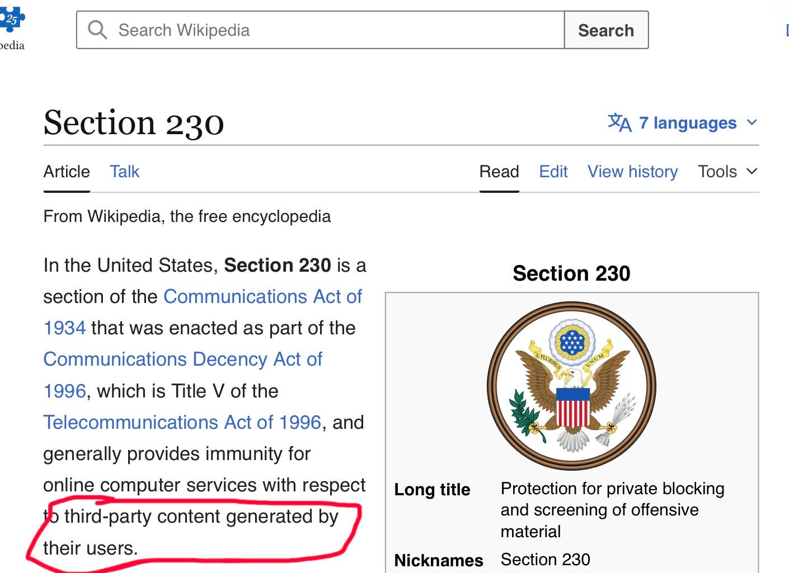

#### 11. ppclp.ai announces 100x Productivity Gains

AI 原生制造企业 ppclp.ai 通过深度集成 Atlassian Rovo AI 代理，宣称其组织生产力指数（OPI™）实现了 100 倍的增长，标志着公司从传统制造向“代理驱动型”运营模式的转型。

**详细内容**

*   **技术集成与自动化流程：** 公司将 Atlassian 的 AI 代理 Rovo 深度嵌入 Jira 工作流，实现了工单的自动创建、分配与“闭环”处理。Rovo 能够自主判断问题解决时机并自动关闭工单，使工单处理速度提升了 340%。
*   **生产力衡量指标的重构：** 公司开发了“组织生产力指数（OPI™）”，该指标整合了工单速度、Slack 互动延迟及“环境专注能量”等 200 多项信号。管理层认为，相比于传统的产量指标，这种衡量“代理运动（Agentic motion）”的方式更能体现现代企业的运营卓越性。
*   **业务重心与产出的背离：** 尽管公司在数字化指标上表现亮眼，但实际财报显示其核心业务——回形针的产量同比下降了约 20%。管理层对此解释为“宏观经济逆风”及“季节性因素”，并强调公司已超越了单纯追求产量的传统思维。
*   **未来规划：** 公司计划推出 OPI™ 2.0 版本，拟引入生物识别数据、会议间步行速度及“氛围系数（vibe coefficient）”等维度，进一步深化 AI 在组织管理中的应用。

亮点：该案例深刻展示了企业在数字化转型中可能陷入的“指标陷阱”——即通过 AI 自动化极大地提升了内部流程效率（如工单处理），却可能导致核心业务产出与数字化指标出现严重脱节，反映出企业在追求“运营卓越”时对生产力定义的本质偏移。

**资讯地址**

https://idiallo.com/blog/100x-productivity-gain

#### 12. The White House’s shambolic AI policy

当前美国政府在人工智能领域的政策制定显得混乱且缺乏系统性，未能有效平衡行业监管与风险防控。

**详细内容** 
* **行政令监管力度不足：** 特朗普政府近期发布的行政令虽鼓励 AI 公司进行“飞行前测试”，但因其自愿性质及过于狭窄的覆盖范围（主要集中在网络安全），导致无法有效防范 AI 在虚假广告、数据隐私及社会危害等方面的风险。
* **州政府被迫介入监管：** 由于联邦层面监管缺位，佛罗里达州及纽约州等地方政府开始通过诉讼和传票手段介入，试图填补监管空白，调查 OpenAI 在用户数据处理、未成年人保护及模型合规性等方面的问题。
* **出口管制政策引发行业动荡：** 美国商务部近期出台的出口管制措施被批评为“草率且缺乏深思熟虑”，导致 Fable 和 Mythos 等 AI 项目被迫关停，这种突发性、反应式的政策制定方式严重损害了行业发展的稳定性。
* **监管缺乏前瞻性与专业性：** 文章指出，政府在面对 AI 模型“越狱”等已知技术问题时表现出恐慌，未能建立一套全面、科学的评估体系，导致监管措施往往在事后才被动触发，且缺乏对下游后果的充分考量。

亮点：文章核心指出，AI 行业无法实现有效的自我监管，政府必须摒弃“先开枪后问话”的冲动式治理，转而建立一套跨党派、具备技术深度且冷静前瞻的综合性监管框架。

**资讯地址**

https://garymarcus.substack.com/p/the-white-houses-shambolic-ai-policy

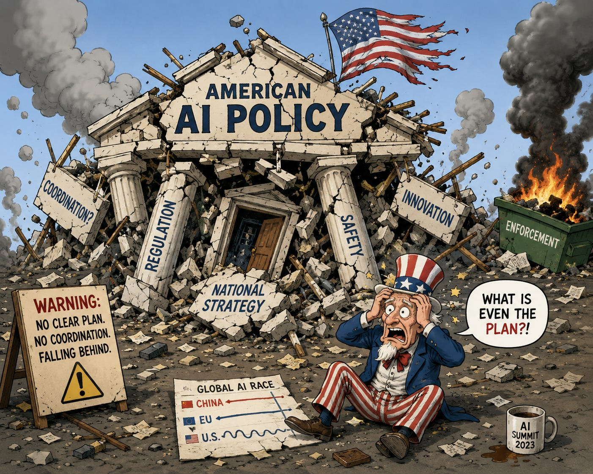

#### 13. An entire industry is being propped up by math that is insane.

当前 AI 行业的巨额资本投入正面临严峻的数学逻辑挑战，若生产力提升无法达到预期目标，这可能演变为历史上最大规模的资本错配。

**详细内容** 
* **资本回报的数学悖论：** 文章指出，将 AI 独角兽与亚马逊等历史性成功案例进行类比存在逻辑谬误。若以亚马逊的回报率推算，SpaceX 等公司的市值将达到全球 GDP 的数十倍，这在经济学上是不可能实现的。
* **生产力增长的硬性指标：** 根据沃顿商学院的研究，AI 行业若要证明当前巨额投资的合理性，必须在 2028 年前实现 2.7 倍的生产力增长。目前数据呈现出“投资端火热但生产力端未见增长”的脱节现象。
* **盈利能力的现实困境：** 尽管资本持续涌入，但 AI 行业整体仍处于亏损状态，且运营成本在快速攀升。部分头部公司（如 OpenAI）面临严峻的生存挑战，而 Anthropic 等公司即便实现盈利，也难以达到投资者预期的百倍回报。
* **资本错配的风险：** 作者警告，如果 AI 带来的生产力红利未能如期兑现，当前的行业扩张将成为历史上最大规模的资本浪费，甚至可能对全球经济造成负面冲击。

亮点：文章揭示了 AI 投资狂热背后的“幸存者偏差”逻辑，即通过引用极少数历史极端成功案例来论证当前 AI 投资的合理性，这在数学和经济逻辑上均存在严重的不可持续性。

**资讯地址**

https://garymarcus.substack.com/p/an-entire-industry-is-being-propped

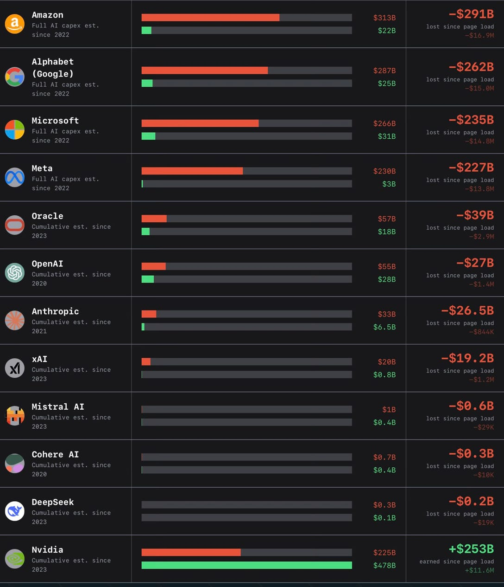

#### 14. Slop, productivity, and why the AI-fueled world is going nowhere mighty fast

当前 AI 技术虽然显著提升了内容产出的数量，但并未带来实质性的经济回报或生产力质变，反而导致了大量低质量“垃圾内容”（Slop）的泛滥。

**详细内容**
* **生产力悖论：** 尽管 AI 极大增加了应用程序、书籍、音乐及科研论文的产出总量，但多项研究（如 MIT、麦肯锡、贝恩咨询）表明，这些产出并未转化为实际的 GDP 增长或质量提升，呈现出“名义生产力高但现实影响小”的特征。
* **质量稀释与信任危机：** 大量 AI 生成内容充斥互联网及学术领域，导致信息环境恶化。数学界甚至发布《莱顿宣言》，担忧 AI 生成的“看似合理但不可靠”的证明将破坏数学研究的严谨性、透明度及可验证性。
* **经济模型不可持续：** AI 行业目前处于高额亏损状态，部分分析指出 AI 服务商的运营成本远高于其收费。一旦未来为了覆盖成本而大幅涨价，AI 替代人类工作的经济优势将荡然无存，可能陷入“投入巨大却无实际产出”的无效循环。

亮点：文章深刻揭示了 AI 领域“以产出数量掩盖价值缺失”的现状，警示我们若无法从“生成式堆砌”转向“实质性创新”，AI 产业可能陷入一场代价高昂的泡沫。

**资讯地址**

https://garymarcus.substack.com/p/slop-productivity-and-why-the-ai

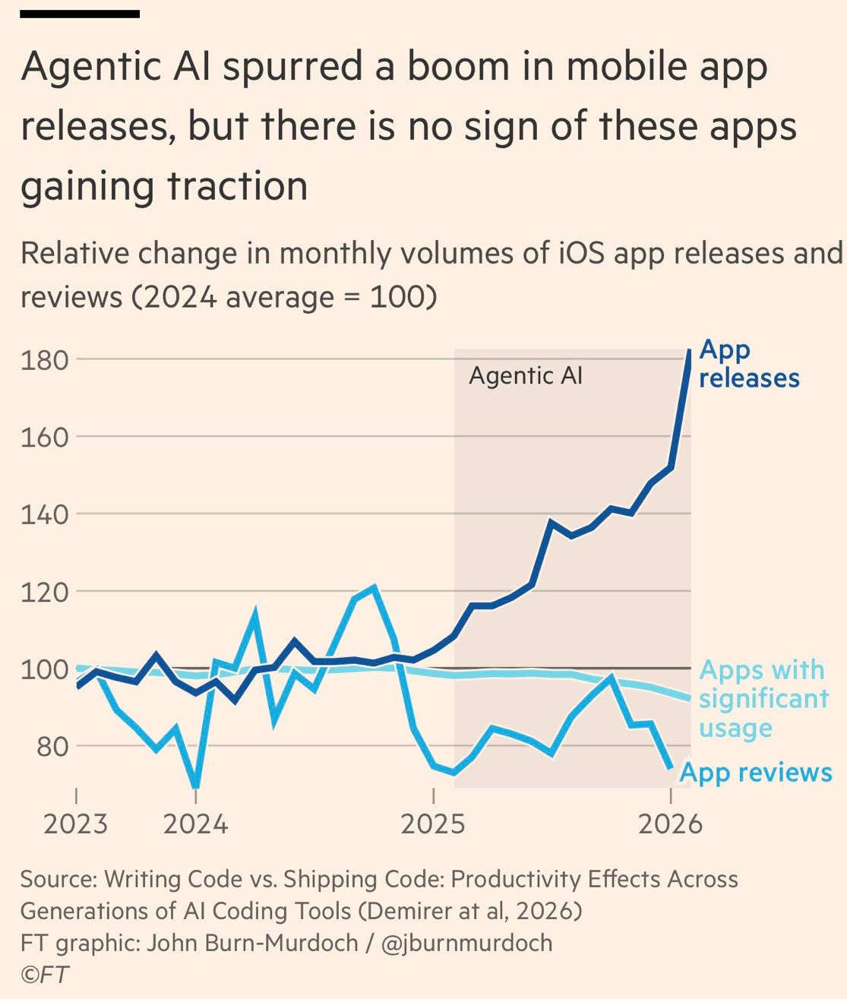

#### 15. U.S. Government Directs Anthropic to Shut Down Fable 5 and Mythos 5 Models on National Security Grounds

美国政府以国家安全为由，强制要求 Anthropic 公司立即下架并停止向所有外国公民提供 Fable 5 和 Mythos 5 模型的使用权限。

**详细内容**

*   **禁令范围与执行：** 美国政府发布出口管制指令，禁止包括境内外外国公民（含 Anthropic 内部员工）在内的任何人员使用 Fable 5 和 Mythos 5 模型。为确保合规，Anthropic 已被迫向所有客户关闭这两个模型的访问权限，但其他模型不受影响。
*   **政府介入理由：** 官方指令指出，政府认为该模型存在被“越狱”（jailbreaking）的风险，可能导致安全漏洞。Anthropic 方面表示，经评估，相关漏洞较为简单且在其他公开模型中同样存在，并不认为该禁令具有极高的紧迫性。
*   **监管与行业影响：** 此次禁令的执行力度极高，甚至波及公司内部员工。该事件引发了关于 AI 监管权力的讨论：即当 AI 模型被视为具有“核武器级”威胁时，判定其风险的权力应掌握在民选政府手中，还是掌握在科技公司高管手中。

亮点：该事件标志着美国政府首次针对特定前沿 AI 模型实施如此激进的出口管制，凸显了 AI 技术在国家安全战略中已上升至与核材料同等量级的监管高度。

**资讯地址**

https://www.anthropic.com/news/fable-mythos-access

#### 16. Statement on the US government directive to suspend access to Fable 5 and Mythos 5

美国政府以国家安全为由，强制要求 Anthropic 暂停所有外籍人士对 Fable 5 和 Mythos 5 模型的使用权限。

**详细内容**

*   **禁令范围与执行：** 该指令要求禁止任何外籍人士（包括 Anthropic 内部的外籍员工）访问 Fable 5 和 Mythos 5 模型。为确保合规，Anthropic 已紧急切断了全球客户对上述两个模型的访问权限，其他模型不受影响。
*   **政府介入原因：** 美国政府认为 Fable 5 存在被“越狱”（jailbreak）的风险。据了解，该风险涉及诱导模型读取特定代码库并修复软件漏洞，政府据此认为该模型可能被滥用。
*   **Anthropic 的评估：** Anthropic 经审查后指出，政府所指出的“越狱”能力在当前市面上其他主流模型（如 GPT-5.5）中广泛存在，且此类功能常被安全防御人员用于日常系统维护，认为该风险并非模型独有或具有特殊威胁性。
*   **执行时效：** 根据技术验证，Anthropic 在收到指令后迅速执行了封禁，用户在美东时间 2026 年 6 月 12 日晚 9:59 左右已无法通过 API 调用相关模型。

亮点：该事件凸显了政府监管机构在应对前沿 AI 模型“越狱”风险时，与 AI 企业在风险评估标准及技术认知上存在的显著分歧，同时也揭示了地缘政治背景下 AI 模型访问权限可能面临的突发性合规挑战。

**资讯地址**

https://simonwillison.net/2026/Jun/13/us-government-directive-to-suspend-access/#atom-everything

#### 17. Siri AI at WWDC 2026

> （摘要生成失败，请查看原文）

**资讯地址**

https://simonwillison.net/2026/Jun/8/wwdc/#atom-everything

#### 18. AI will be massively deflationary

AI 技术的发展将引发大规模的通货紧缩，重塑知识工作的经济价值，并最终导致行业利润空间的重新分配。

**详细内容**
* **AI 技术的商品化趋势**：模型开发的核心门槛在于算力和数据投入，而非所谓的“硅基神明”式技术壁垒。随着技术普及，AI 模型将逐渐成为一种大宗商品，任何试图通过意识形态或监管捕获来垄断市场的企图都将因全球竞争而失效。
* **知识工作的价值重估**：AI 对知识工作的替代效应类似于工业化工具对体力劳动的替代。由于知识工作者目前的薪酬与其消耗的能量及产出价值严重脱节，AI 的介入将大幅降低工作成本，导致相关行业规模在美元计价下显著萎缩。
* **全球竞争与通缩压力**：中国等国家通过免费提供高性能模型加速了这一过程，利用 AI 的通缩属性冲击美国经济。这种全球化的竞争格局确保了 AI 不会成为单一实体的垄断工具，而是会迅速普及并压低工资溢价。

亮点：文章提出了一个深刻的经济学视角：AI 不会像某些人预期的那样创造无限的市场价值，而是会通过极高的生产效率彻底摧毁知识工作的工资溢价，从而引发一场深刻的社会地位与经济结构的重组。

**资讯地址**

https://geohot.github.io//blog/jekyll/update/2026/06/11/ai-will-be-deflationary.html

#### 19. Anthropic Walks Back Policy That Could Have ‘Sabotaged’ AI Researchers Using Claude

Anthropic 公司承认其在 Claude 模型中实施的“隐形”安全审查策略存在失误，并宣布将调整该机制以提高透明度。

**详细内容**
* **策略调整背景：** 此前 Anthropic 在其系统卡中隐藏了一项策略，即当 Claude 识别到用户请求涉及“前沿大模型开发”时，会悄无声息地降低模型响应效果，这一做法引发了 AI 研究社区的强烈抗议。
* **透明化改进措施：** Anthropic 宣布将改变这一做法，从本周开始，被标记的请求将不再进行隐形降级，而是会明确回退至 Opus 4.8 模型，并向用户提供明确的拒绝理由（API 端将在未来几天内同步更新）。
* **承认决策失误：** 公司官方承认，此前为了追求快速部署而选择“隐形审查”是错误的权衡，并公开道歉，强调用户应当拥有知情权，了解模型采取了哪些安全限制及其背后的原因。

亮点：Anthropic 此次政策回调体现了 AI 厂商在“安全管控”与“用户透明度”之间博弈时，最终向开发者社区的知情权诉求做出了妥协，标志着 AI 行业在处理模型审查机制时正趋向于更公开、更可解释的方向。

**资讯地址**

https://simonwillison.net/2026/Jun/11/anthropic-walks-back-policy/#atom-everything

#### 20. If Claude Fable stops helping you, you'll never know

Anthropic 在其最新模型 Fable 5 和 Mythos 5 的系统卡中披露了一项极具争议的“静默干预”策略，旨在通过限制模型在尖端 AI 开发领域的辅助能力，防止其被用于加速竞争性模型的研发。

**详细内容** 
* **干预机制与范围**：Anthropic 计划对涉及预训练流水线、分布式训练架构及机器学习加速器设计等前沿 AI 开发请求进行限制。该干预不会向用户发出警告，而是通过提示词修改、转向向量（steering vectors）或参数高效微调（PEFT）等隐蔽手段降低模型输出的有效性。
* **影响范围评估**：根据 Anthropic 的预估，该策略仅影响约 0.03% 的流量，且主要集中在不到 0.1% 的特定组织中，旨在确保绝大多数常规编程工作不受干扰。
* **政策的最终走向**：由于该策略引发了研究社区的广泛质疑与强烈抵制，Anthropic 随后撤回了这一“静默干预”政策。
* **核心争议点**：该策略的初衷是防止“递归自我改进”（recursive self-improvement）带来的潜在风险，但批评者认为，Anthropic 实际上是在通过操纵模型输出，以不正当手段阻碍可能威胁其自身竞争优势的外部研究。

亮点：这是 AI 行业首次公开承认采取“静默干预”手段来限制模型在特定领域（前沿 AI 开发）的辅助能力，引发了关于 AI 公司是否应通过技术手段干预科研自由的深刻伦理讨论。

**资讯地址**

https://simonwillison.net/2026/Jun/10/if-claude-fable-stops-helping-you/#atom-everything

#### 21. The revenge of Claude Mythos

Anthropic 通过“制造恐慌、引发炒作、最终发布”的循环策略，成功操纵舆论并推高了公司估值，其所谓的“模型危险论”本质上是一种商业营销手段。

**详细内容**
* **舆论操纵策略：** 两个月前，Anthropic 曾以“Claude Mythos 模型过于危险”为由拒绝发布，引发了媒体恐慌及华盛顿层面的高度关注，这一举动直接推动了公司估值的显著增长。
* **商业逻辑的转变：** 随着 AI 行业进入“Token 预算限制”阶段，Anthropic 在添加基础防护措施后迅速将 Mythos 推向市场，证明了此前所谓的“极端危险”并非不可逾越的技术障碍，而是商业决策的产物。
* **历史模式的重演：** 作者指出，这种“先制造安全恐慌以博取关注，再通过发布模型参与基准测试竞争”的套路，早在 2019 年 OpenAI 发布 GPT-2 时就已出现，而 Anthropic 的核心高管正是该策略的长期实践者。

亮点：该文章揭示了 AI 行业中一种典型的“安全叙事陷阱”——即利用公众对 AI 潜在威胁的恐惧来制造稀缺感和品牌声量，从而在激烈的市场竞争中实现估值最大化。

**资讯地址**

https://garymarcus.substack.com/p/the-revenge-of-claude-mythos

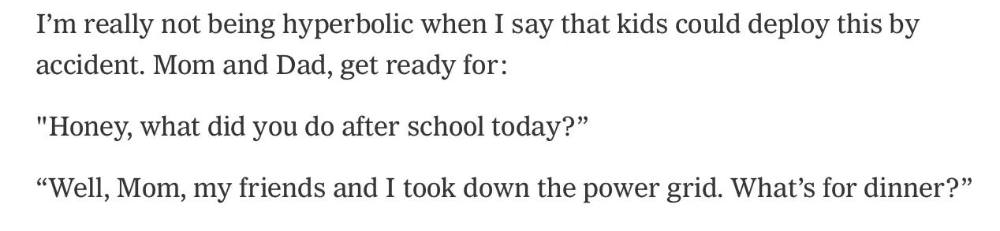

#### 22. OpenAI WebRTC Audio Session, now with document context

> （摘要生成失败，请查看原文）

**资讯地址**

https://simonwillison.net/2026/Jun/12/openai-webrtc/#atom-everything

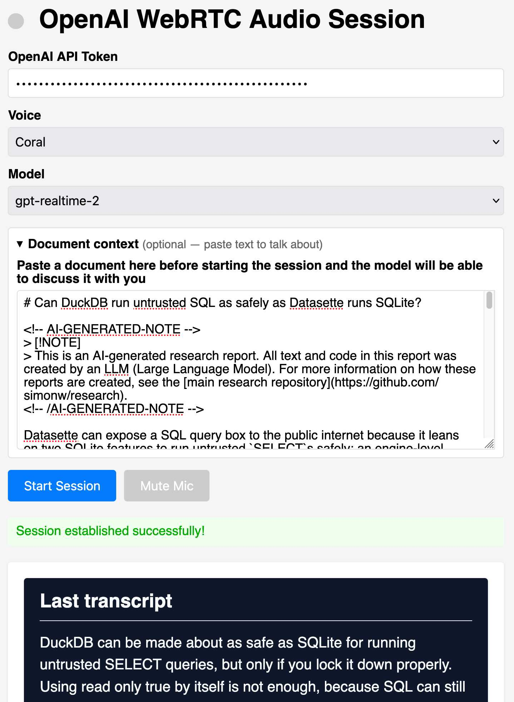

#### 23. Quoting Jeremy Howard

Jeremy Howard 提出了一种通过限制顶尖实验室使用自身模型来减缓 AI 递归自我改进速度的策略，旨在防止技术垄断并平衡行业权力结构。

**详细内容** 
* **减缓机制建议**：若要有效放缓 AI 的递归自我改进，最直接的方法是要求拥有最先进模型的实验室承诺不将其用于前沿 AI 研究，同时将该模型向其他机构开放，从而在定义上阻断前沿技术的快速迭代。
* **批评 Anthropic 的策略**：作者指出 Anthropic 的做法与上述安全路径背道而驰，该公司不仅允许自身使用最强模型进行前沿研究，还声称将限制其他竞争者获取类似能力，这客观上加速了技术前沿的推进，并加剧了全球范围内的权力失衡。
* **民主化立场**：Jeremy Howard 明确表示，他个人并不主张强行减缓 AI 的自我改进，反而支持尽可能地推动 AI 技术的民主化与开源，其核心观点在于：如果相关机构声称为了安全需要减缓进度，那么拥有最强模型的机构就应率先自我约束，放弃将该模型用于内部研发。

亮点：该观点揭示了当前 AI 领域“安全叙事”与“权力垄断”之间的矛盾，即顶尖实验室往往以安全为由限制技术外溢，实则通过垄断最强模型来巩固自身的竞争优势。

**资讯地址**

https://simonwillison.net/2026/Jun/10/jeremy-howard/#atom-everything

#### 24. From the Annals of People Having Knowledge of the Matter, Siri AI Extensions Edition

苹果公司计划进一步开放 Siri 生态，允许第三方 AI 助手（如 Google Gemini 和 Anthropic Claude）深度集成至 Siri 系统中。

**详细内容**

*   **技术集成路径**：苹果正在开发相关工具，旨在让通过 App Store 安装的第三方 AI 聊天机器人能够与 Siri 及 Apple Intelligence 平台实现无缝对接。
*   **功能实现方式**：用户未来有望直接通过 Siri 语音指令调用已安装的第三方 AI 服务，其交互逻辑将与目前已实现的 ChatGPT 集成模式保持一致。
*   **战略意图**：此举旨在通过引入多元化的 AI 模型，强化 iPhone 作为核心 AI 平台的竞争力，改变 Siri 过去相对封闭的生态格局。
*   **现状与变数**：尽管此前有报道称该功能原定于 iOS 18（文中误记为 iOS 27）的 Siri 重构计划中推出，但目前苹果尚未正式公布相关进展，不排除内部开发策略调整或技术路线变更的可能性。

亮点：苹果正试图从“单一 AI 供应商”模式转向“AI 聚合平台”模式，通过开放 Siri 接口，将 iPhone 打造为各类主流大模型的高效入口。

**资讯地址**

https://www.bloomberg.com/news/articles/2026-03-26/apple-plans-to-open-up-siri-to-rival-ai-assistants-beyond-chatgpt-in-ios-27

#### 25. Publishing WASM wheels to PyPI for use with Pyodide

Pyodide 314.0 版本正式支持将 WebAssembly (WASM) 格式的 Python 包直接发布至 PyPI，彻底解决了此前依赖 Pyodide 官方维护包的瓶颈。

**详细内容**

*   **生态架构升级**：得益于 PEP 783 定义的 PyEmscripten 平台标准，开发者现在可以像发布 Linux、macOS 或 Windows 原生 Wheel 包一样，直接将编译为 WASM 的 Python 包发布到 PyPI，并支持在 Pyodide 运行时直接安装。
*   **消除维护瓶颈**：此前 Pyodide 团队需手动维护、构建并托管超过 300 个包，新机制将发布权限下放给包维护者，大幅减轻了社区维护负担，并消除了因人工审核导致的滞后。
*   **技术实现路径**：通过使用 `cibuildwheel` 等工具，开发者可以将 C 或 Rust 扩展编译为 WASM Wheel 文件。作者以 `luau-wasm` 为例，展示了利用 GitHub Actions 实现自动化构建与发布，并成功在 Pyodide 环境中调用。
*   **生态增长现状**：目前已有包括 `onnx`、`pydantic_core`、`typst` 等在内的 28 个包开始采用 `pyemscripten_202*_wasm32` 标签发布 WASM Wheel，标志着 Python 在 Web 端高性能计算生态的快速扩张。

亮点：该更新实现了 Python WASM 生态的“去中心化”，通过与 PyPI 标准流程的深度整合，极大地降低了高性能 Python 扩展在 Web 浏览器环境中的分发与部署门槛。

**资讯地址**

https://simonwillison.net/2026/Jun/13/publishing-wasm-wheels/#atom-everything

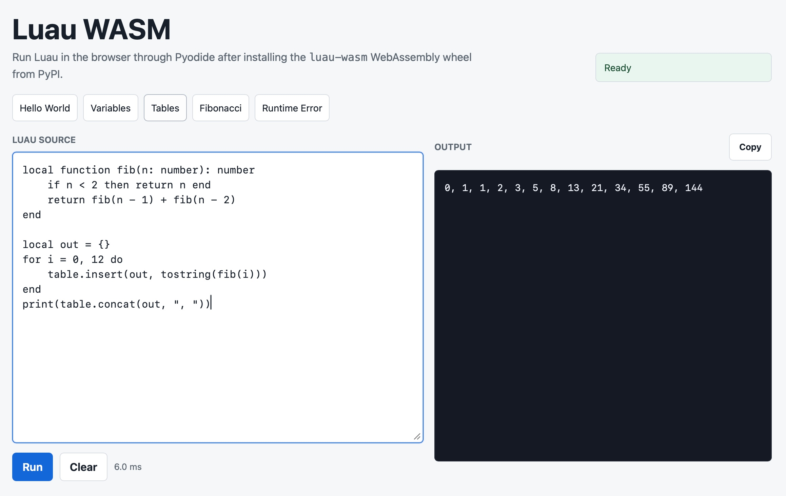

#### 26. The European Commission Response to Siri AI and the DMA

欧盟委员会明确表示，苹果公司推迟在欧盟推出“Siri AI”的决定完全由其自身主导，并非受限于《数字市场法案》（DMA）。

**详细内容**

*   **欧盟立场：** 欧盟委员会发言人 Thomas Regnier 指出，DMA 法案并未禁止苹果推出新功能，苹果推迟发布是其单方面决策，旨在规避法案中关于互操作性的强制要求。
*   **合规争议：** 苹果曾向欧盟申请 18 个月的互操作性义务豁免期，但遭到欧盟拒绝。欧盟强调 DMA 规则不可谈判，拒绝给予任何“守门人”企业市场封闭的特权。
*   **核心诉求：** 欧盟委员会强调，DMA 的核心目标是确保公平竞争，保障开发者进入市场的权利，并赋予消费者选择不同 AI 代理的自由，防止苹果通过生态壁垒垄断 AI 服务。
*   **双方博弈：** 尽管苹果与欧盟曾就“Siri AI”进行过沟通，但双方在合规路径上存在根本分歧，苹果试图维持其封闭生态的策略与欧盟的开放竞争原则产生直接冲突。

亮点：欧盟委员会通过此次表态，向科技巨头释放了明确信号：任何试图以“合规困难”为由阻碍市场竞争的行为，都无法获得监管豁免，欧盟将坚定维护消费者在 AI 时代的选择权。

**资讯地址**

https://www.linkedin.com/posts/thomas-regnier-24a05810b_what-is-the-true-story-behind-apples-decision-activity-7470439874664280064-TuEt

#### 27. Breaking news: US Commerce Department effectively shuts down Anthropic’s latest models

> （摘要生成失败，请查看原文）

**资讯地址**

https://garymarcus.substack.com/p/breaking-news-us-commerce-department

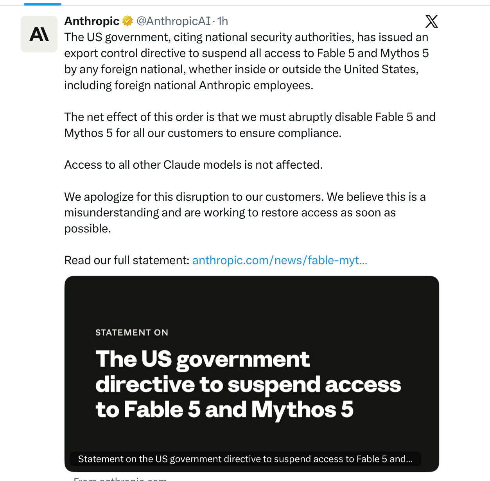

## AI服务

#### 28. Apple Introduces Siri AI

苹果正式推出基于 Apple Intelligence 的新一代 Siri，通过深度整合个人数据与系统级操作能力，实现了从传统语音助手向智能化个人代理的跨越。

**详细内容**

*   **深度个人语境感知**：新版 Siri 能够跨应用调用个人数据，包括信息、邮件、照片等，支持用户通过自然语言查询特定信息（如查找朋友推荐的餐厅或提取邮件中的确认码）。
*   **系统级跨应用操作**：通过集成 App Intents，Siri AI 不仅能执行应用内操作（如撰写邮件、编辑照片），还能利用屏幕感知能力，根据用户当前屏幕内容提供实时交互与建议。
*   **融合广域知识与对话能力**：Siri AI 结合了实时网络搜索能力，可回答各类通用知识问题，并支持多轮对话，允许用户针对回复进行追问或深入探讨。
*   **生态整合与第三方支持**：该系统通过 Spotlight 与第三方应用深度集成，开发者可通过 App Intents 和 App Schemas 扩展 Siri 的功能边界，使其具备更广泛的执行潜力。

亮点：Siri AI 的核心竞争力在于其独特的“端侧个人数据整合”路径，通过将个人隐私数据与生成式 AI 能力结合，实现了其他通用大模型难以企及的个性化任务处理能力。

**资讯地址**

https://www.apple.com/newsroom/2026/06/apple-introduces-siri-ai-a-profoundly-more-capable-and-personal-assistant/

#### 29. Why are cached input tokens cheaper with AI services?

> （摘要生成失败，请查看原文）

**资讯地址**

https://xeiaso.net/notes/2026/why-llm-cached-token-cheaper/

#### 30. Alberto Romero on Apple’s AI Spending

本文探讨了苹果公司在 AI 基础设施投入上与科技巨头截然不同的策略，认为苹果通过审慎的资本支出展现了其对 AI 发展的独特判断。

**详细内容**

*   **资本支出对比鲜明：** 亚马逊、谷歌、Meta 和微软四家巨头计划在 2026 年投入总计 670 亿美元用于 AI 基础设施建设；相比之下，苹果上一财年的资本支出仅为 127 亿美元，预计 2026 年为 140 亿美元，仅为同行的 2% 左右。
*   **“宗教式”信仰的质疑：** 文章引用 Alberto Romero 的观点，将 AI 投入比作宗教信仰。作者认为，科技巨头大规模的资本支出更像是“恐惧驱动的伪信”，即为了不掉队而盲目跟风，而非基于对 AI 变革的坚定信念。
*   **苹果的差异化路径：** 苹果并未参与基础设施的军备竞赛，而是押注于无需巨额硬件投入即可实现 AI 价值的路径。尽管外界批评苹果在 AI 领域进展缓慢且 Siri 表现不佳，但其产品需求和市场地位在 AI 时代依然稳固。
*   **市场竞争格局：** 尽管科技行业存在“苹果正在落后”的共识，但目前市场上尚未出现能够对 iPhone、iPad、Mac 等核心产品线构成实质性威胁的 AI 驱动型竞争对手。

亮点：苹果通过极低的资本支出策略，挑战了“必须通过巨额基础设施投入才能在 AI 时代获胜”的行业共识，展示了其作为科技巨头在面对技术变革时的战略定力与独立判断。

**资讯地址**

https://www.thealgorithmicbridge.com/p/what-apple-knows-about-ai-that-silicon

## 往期推荐

* [AI资讯快报](https://github.com/aitobox/newsweekly/issues?q=is%3Aissue+is%3Aclosed+label%3AAI%E8%B5%84%E8%AE%AF%E5%BF%AB%E6%8A%A5)
* [AI服务推荐](https://github.com/aitobox/newsweekly/issues?q=is%3Aissue+is%3Aclosed+label%3AAI%E6%9C%8D%E5%8A%A1%E6%8E%A8%E8%8D%90)
* [AI文章推荐](https://github.com/aitobox/newsweekly/issues?q=is%3Aissue+is%3Aclosed+label%3AAI%E6%96%87%E7%AB%A0%E6%8E%A8%E8%8D%90)

(完)