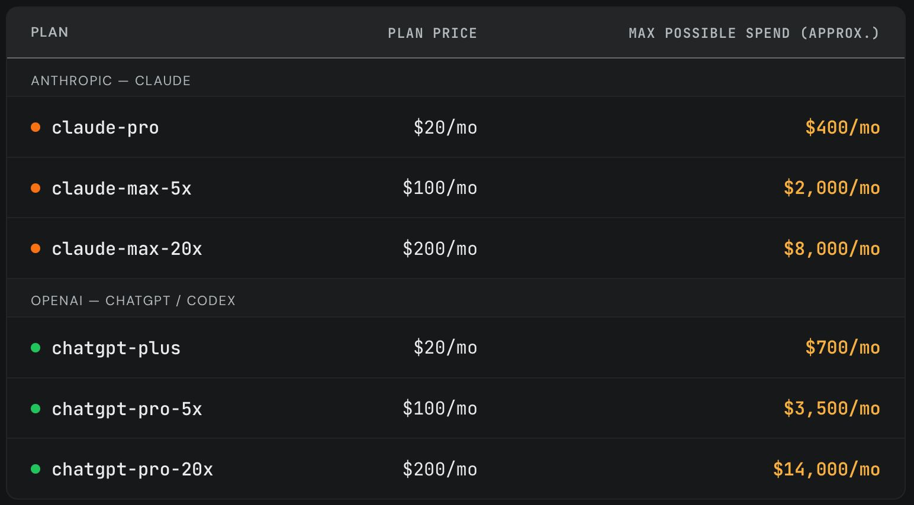
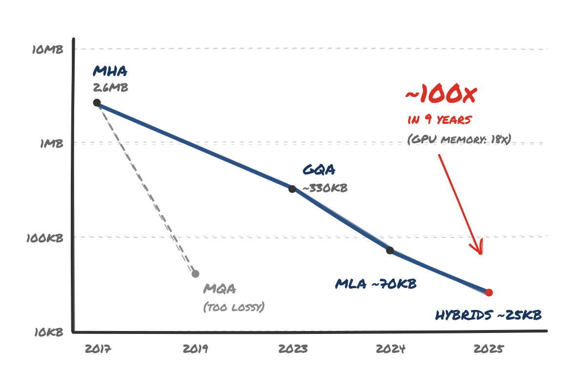
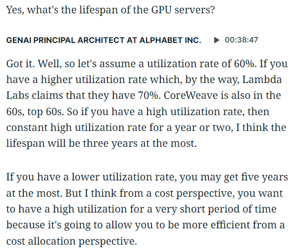
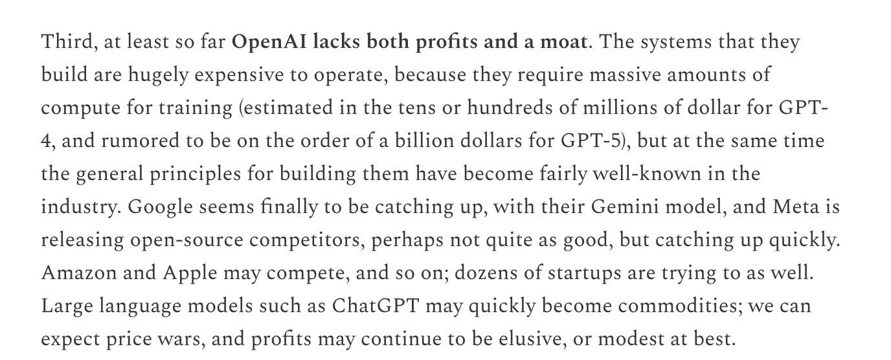
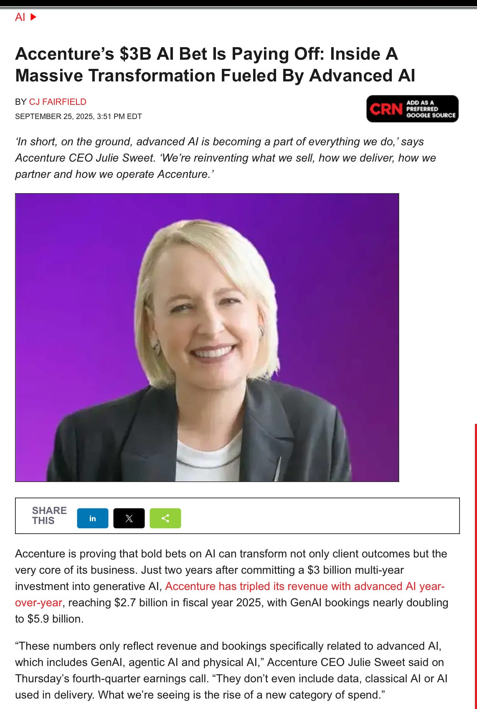
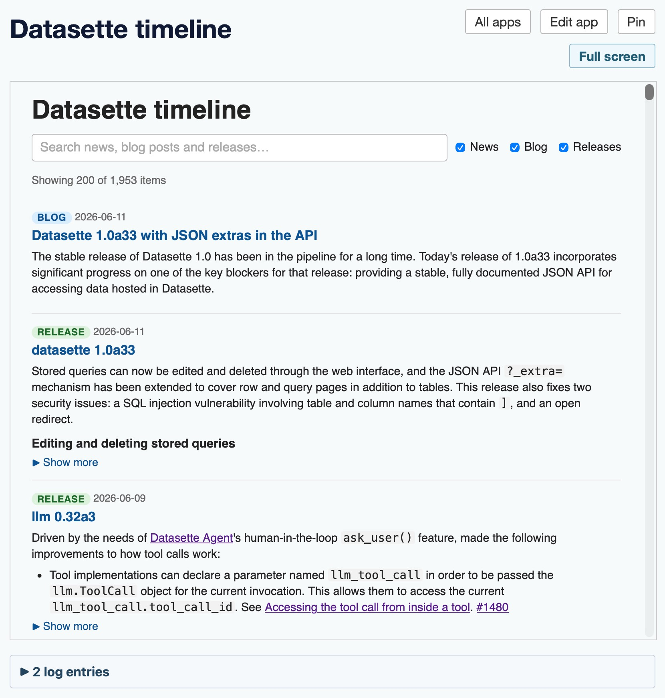

# AIToBox周刊：20260621

这里记录每周值得分享的AI科技内容，周末发布。

本杂志开源（GitHub: [aitobox/newsweekly](https://github.com/aitobox/newsweekly)），欢迎提交 issue，投稿或推荐你的项目。

> **统计周期**: 2026-06-14 ~ 2026-06-21 | **共收录优质资讯**：30 篇

## 🌟 本期头条 (Headline)

### **[Exclusive: OpenAI Losses Increased Nearly 8X in 2025, With Spending Hitting $34 Billion](https://www.wheresyoured.at/exclusive-openai-financials/)** - *wheresyoured.at*

**深度解读**

本期头条披露的OpenAI 2025年财务数据，无异于在狂热的AI资本市场投下了一枚深水炸弹。数据显示，OpenAI的年度亏损额从2024年的50.9亿美元激增至2025年的385.3亿美元，亏损规模扩大近8倍。这一数字不仅远超市场预期，更将AI行业的“烧钱”竞赛推向了前所未有的高度。从财务结构看，OpenAI的研发支出高达191.8亿美元，而支付给微软的各类费用总计达172亿美元，这揭示了一个残酷的现实：OpenAI目前本质上是微软云基础设施的“超级租户”，其收入增长虽然显著，但远不足以覆盖庞大的算力折旧与模型训练成本。

此次亏损的激增，部分源于公司从非营利组织向营利性实体的转型，导致了巨额的股权与可转换权益调整。然而，剔除这些会计层面的账面波动，其核心运营亏损依然高达209.2亿美元。这一数据引发了行业对AI商业模式可持续性的深度质疑：当算力成本与研发投入呈指数级增长，而营收增速却难以同步匹配时，OpenAI是否正陷入一场“规模不经济”的陷阱？

对于整个科技行业而言，这份财报标志着AI泡沫化风险的加剧。OpenAI作为行业领头羊，其财务状况是整个大模型生态的晴雨表。如果连拥有顶级融资能力的OpenAI都面临如此惊人的现金消耗，那么其他处于追赶地位的AI初创公司将面临更严峻的融资寒冬。未来，投资者将不再仅仅关注模型参数的迭代，而是会更苛刻地审视AI企业的单位经济效益（Unit Economics）。这场由算力驱动的“军备竞赛”，正在从技术比拼转向资本耐力测试，而OpenAI能否在现金流耗尽前实现盈利，将决定这一轮AI浪潮的最终走向。

**核心摘录 (Core Highlights)**

> **EN**: OpenAI’s financial statements tell the story of a company with incredible losses. Revenue: $3.7 billion Cost of Revenue: $2.65 billion Research and Development: $7.81 billion Sales and Marketing: $1.11 billion General and Administrative: $907 Million Total Costs and Expenses: $12.48 billion Loss from Operations: $8.78 billion.
> **ZH**: OpenAI的财务报表讲述了一家亏损惊人的公司。营收为37亿美元，营收成本为26.5亿美元，研发费用为78.1亿美元，销售与营销费用为11.1亿美元，一般及行政费用为9.07亿美元。总成本与费用为124.8亿美元，运营亏损为87.8亿美元。

> **EN**: The financial condition of OpenAI is deeply concerning. $38.53 billion in losses are astronomical, and far higher than most believed it would be. Losses also appear to be mounting year-over-year at a dramatic rate, and I’m not sure how this company finds a way toward any kind of sustainability or profitability.
> **ZH**: OpenAI的财务状况令人深感担忧。385.3亿美元的亏损额是天文数字，远高于大多数人的预期。亏损似乎正以惊人的速度逐年攀升，我不确定这家公司如何才能找到通往可持续发展或盈利的路径。

## AI资讯

#### 1. All pieces on a 6 by 5 board

本文探讨了如何利用大语言模型（Claude）生成 Z3 约束求解器代码，以解决在 6×5 棋盘上放置特定棋子且互不攻击的组合数学难题。

**详细内容**

*   **问题定义**：在 6×5 的棋盘上放置国王、皇后、两名主教、两名骑士和两名车（共 8 枚棋子），要求两名主教必须位于不同颜色的格子上，且所有棋子之间互不攻击。
*   **技术路径**：利用 Claude 生成 Python 代码，调用 Z3 约束求解器（SMT Solver）进行逻辑建模。通过定义棋盘坐标、各棋子的攻击规则（如主教的对角线攻击、骑士的“日”字攻击等）以及位置互斥约束，将棋盘问题转化为数学可满足性问题。
*   **计算结果**：程序共计算出 192 种原始解。通过对主教、骑士和车等同类棋子的位置进行去重（即忽略同类棋子间的互换），最终得出 24 种本质不同的唯一解。
*   **逻辑优化**：为了提升求解效率，代码采用了预构建攻击查找表（Lookup Table）的方法，避免了在 Z3 中进行复杂的符号逻辑推理，从而显著优化了求解性能。

亮点：该案例展示了 LLM 在辅助编写复杂算法与约束求解代码方面的强大能力，通过将自然语言描述的逻辑约束转化为严谨的数学代码，有效解决了组合优化问题。

**资讯地址**

https://www.johndcook.com/blog/2026/06/20/z3-python-claude/

#### 2. Premium: The Silicon Valley Bubble (Part 2)

本文通过剖析 OpenAI 2024-2025 年的财务审计数据，揭示了硅谷在 AI 狂热下通过资本运作与叙事包装掩盖巨额亏损的泡沫本质。

**详细内容**

*   **财务表现堪忧：** OpenAI 在 2025 年的财务状况显示其支出高达 340 亿美元，而营收仅为 130.7 亿美元，导致高达 210 亿美元的净亏损，且公司通过复杂的会计手段（如“非控股成员资本净亏损”）来掩盖真实的财务困境。
*   **营收真实性存疑：** 文章指出，软银（SoftBank）对 OpenAI 的营收贡献可能存在异常，特别是与“Crystal Intelligence”项目相关的资金往来，被质疑是为了在特定时间节点人为美化营收数据。
*   **行业叙事脱离现实：** 硅谷当前的 AI 产业已演变为一种“伪宗教式”的资本共识，通过贩卖对未来的恐惧或虚幻的愿景，将原本普通的云端软件包装成“通用人工智能”，以此维持高估值并规避对现有产品责任的追究。
*   **批判性视角：** 作者引用 Cal Newport 的观点，强调 AI 应被视为一种具体的商业工具而非不可抗拒的自然力量，批评行业领袖通过“末日论”或“乌托邦叙事”来绑架公众认知，阻碍对 AI 技术经济可行性的理性审视。

亮点：文章最核心的启发在于指出，硅谷的 AI 泡沫已从单纯的商业投机演变为一种“身份认同危机”，即支持者将对 AI 的质疑视为对个人信仰的攻击，从而导致整个行业丧失了基于现实逻辑进行评估的能力。

**资讯地址**

https://www.wheresyoured.at/premium-the-silicon-valley-bubble-part-2/

#### 3. Formalizing a ring theorem with Lean 4 and Claude

本文探讨了利用 AI 模型 Claude 辅助进行 Lean 4 数学定理形式化证明的实验过程与局限性。

**详细内容**

*   **实验目标与任务**：作者要求 Claude 对“主理想整环（PID）上的分式域部分分式分解”这一抽象代数定理进行 Lean 4 形式化证明，而非简单的计算验证。
*   **AI 的推理能力**：Claude 能够准确识别任务难度，并自主制定了基于“最低项表示、素因子分解及中国剩余定理/贝祖等式”的合理证明策略，展现了较强的数学逻辑规划能力。
*   **形式化过程的挑战**：在 11 次迭代过程中，代码主要受限于 Lean 4 数学库（Mathlib）的频繁更新导致的 API 变动以及模型产生的幻觉错误。
*   **当前成果与局限**：最终生成的代码框架完整，但包含 5 处未证明的“sorry”占位符，且在处理复杂依赖时未能完全通过编译，反映了当前 AI 在处理深度形式化验证任务时仍需人工介入调试。

亮点：该实验揭示了 AI 在辅助数学形式化证明中“逻辑规划强、代码实现弱”的现状，即 AI 能够提供高质量的证明思路，但在处理高度依赖特定版本库的语法细节和严谨性补全方面仍存在显著瓶颈。

**资讯地址**

https://www.johndcook.com/blog/2026/06/17/rings-with-lean-claude/

#### 4. Quaternion Rotations, Claude, and Lean

本文探讨了利用 AI 模型 Claude 辅助验证数学定理的过程，展示了 AI 在识别技术文档错误及生成形式化证明代码方面的潜力。

**详细内容**

*   **错误识别能力**：作者利用 Claude (Sonnet 3.5) 验证关于四元数与旋转矩阵转换的数学定理。Claude 成功识别出作者旧博客文章中 Python 代码与 LaTeX 描述之间的不一致，并准确判断出 Python 代码为正确逻辑。
*   **形式化验证路径**：在 AI 的辅助下，作者生成了 Lean 4 代码，通过 `Mathlib` 库对四元数转旋转矩阵的定理（正交性验证）及逆转换定理（Chiaverini–Siciliano 公式）进行了严格的形式化证明。
*   **交互式调试过程**：AI 生成代码并非一蹴而就，经过了四轮迭代，通过不断反馈错误信息，最终成功产出了可运行且逻辑严密的 Lean 4 证明代码。
*   **数学严谨性**：证明过程涵盖了矩阵列范数、正交性以及行范数的验证，利用 `nlinarith` 和 `linear_combination` 等策略完成了复杂的代数推导。

亮点：该案例展示了 AI 不仅能作为编程助手，还能作为“数学纠错员”，通过跨模态（代码与文档）的逻辑比对，辅助人类发现并修复技术文档中的隐蔽错误，并进一步通过形式化语言（Lean）实现数学证明的自动化。

**资讯地址**

https://www.johndcook.com/blog/2026/06/15/quaternions-claude-lean/

#### 5. AI's Brokenomics

本文深度剖析了 Anthropic 因其模型安全性漏洞引发美国政府出口管制，揭示了 AI 行业过度炒作“生存威胁”叙事所带来的监管反噬与经济泡沫风险。

**详细内容**

*   **监管强制干预：** 由于 Anthropic 的 Fable 模型被研究人员迅速破解，且存在被中国获取的风险，美国政府以国家安全为由，下达了紧急出口管制令，强制要求 Anthropic 在 90 分钟内停止向非美国公民提供 Mythos 和 Fable 模型的使用权限。
*   **安全叙事的反噬：** Anthropic 长期通过渲染模型“过于强大、危险”的叙事来获取高估值，但其所谓的“安全护栏”在实际测试中表现脆弱。文章指出，这种基于恐慌营销的商业策略最终导致了政府的强力介入，使公司陷入了自食其果的监管困境。
*   **技术与泡沫的脱节：** 作者认为，Mythos 等模型本质上仍是常规的大语言模型，并未实现所谓的“递归自我改进”。Anthropic 试图通过神秘主义和末日论调来维持其近万亿美元的估值，这种脱离现实的炒作模式正面临日益严峻的合规与信任危机。
*   **行业政治经济学风险：** 微软 CEO 萨提亚·纳德拉的表态暗示了行业对“少数模型垄断一切”的担忧。文章强调，如果 AI 行业持续无视社会许可与监管边界，其政治经济基础将难以维持，AI 泡沫的破裂可能比预期更快到来。

亮点：文章最核心的启发在于揭示了“恐慌营销”的双刃剑效应——AI 公司为了融资而过度夸大模型的危险性，最终导致政府将其视为国家安全威胁并实施严厉监管，这种“搬起石头砸自己脚”的现象是当前 AI 泡沫破裂的重要前兆。

**资讯地址**

https://www.wheresyoured.at/brokenomics/

#### 6. A brief history of KV cache compression developments

AI 领域通过算法优化实现了 KV Cache 的高效压缩，使模型上下文处理能力的提升速度远超硬件显存的增长速度。

**详细内容**
* **核心瓶颈与突破：** KV Cache 是存储 LLM 上下文的关键，其内存占用直接限制了会话长度。自 2017 年以来，存储单 Token 上下文所需的内存需求下降了约 100 倍，而同期顶级数据中心 GPU 的显存仅增长了 18 倍，表明 AI 的“内存墙”主要通过算法创新而非单纯的硬件堆叠得以解决。
* **技术演进路径：**
    * **MQA (2019)：** 通过多查询头共享 KV 头实现 64 倍压缩，但因模型质量下降和训练不稳定，应用受限。
    * **GQA (2023)：** 采用分组查询注意力机制，在压缩率与模型质量之间取得平衡，成为 Llama 2 等主流模型的标配。
    * **滑动窗口注意力：** 通过限制部分层对近期 Token 的关注，有效控制了 KV Cache 的增长，推动了上下文窗口从 4K 向 128K 的跨越。
    * **MLA (2024)：** DeepSeek 提出的多头潜在注意力机制，通过将 KV 压缩为小型潜在向量并融合解压步骤，在不损失质量的前提下实现了 93% 的缓存缩减。
* **行业影响：** 高效的 KV Cache 压缩技术不仅支撑了长文本处理和复杂 Agent 工作流，还显著降低了推理成本，DeepSeek 的技术突破甚至对 GPU 市场格局产生了深远影响。

亮点：AI 领域通过算法层面的“压缩编码”（类似于视频领域的 H.264），在硬件性能提升有限的情况下，实现了上下文处理能力的指数级飞跃，证明了软件优化在突破算力瓶颈中的核心作用。

**资讯地址**

https://martinalderson.com/posts/a-brief-history-of-kv-cache-compression-developments/

#### 7. I know Kung-fu

尽管人工智能提供了触手可及的海量信息，但真正的知识获取仍需通过深度思考与时间沉淀来构建心智模型。

**详细内容** 
* **信息与知识的本质区别**：文章指出，AI 能够快速提供答案和定义，但这仅是“信息”的获取。真正的“知识”需要将信息在脑中进行消化、内化，并形成逻辑关联，这一过程无法通过简单的下载或复制完成。
* **AI 对认知能力的潜在削弱**：作者通过自身编程实践发现，过度依赖 AI 解决问题会导致个人思维能力的退化。当用户不亲自构建代码逻辑或心智模型时，即便产出结果令人满意，用户也无法真正掌握该技能，导致在后续调试或修改时缺乏自信。
* **经验与批判性思维的重要性**：作者认为，当学习一个完全陌生的领域时，AI 的输出看似完美；但在自己具备专业背景的领域（如软件开发），AI 的局限性便会显现。真正的理解往往源于“顿悟”时刻，即通过长期的积累与思考，将零散的知识点串联成完整的认知框架。
* **时间是认知的必要投入**：文章强调，即便拥有最先进的 AI 工具，学习依然无法跳过“时间”这一核心要素。知识的形成需要大脑对信息进行反复咀嚼和处理，这与《黑客帝国》中瞬间下载技能的幻想截然不同。

亮点：文章深刻揭示了“信息过载”与“认知匮乏”之间的悖论，指出 AI 虽能加速信息的获取，但无法替代人类大脑在构建深度理解时所必须经历的“消化”过程。

**资讯地址**

https://idiallo.com/blog/i-know-kung-fu

#### 8. Flax debugging: making a hash of things

本文通过一种巧妙的哈希校验技巧，解决了在 JAX/Flax NNX 框架下调试大规模模型参数更新失效的问题。

**详细内容**

*   **调试痛点分析**：在训练拥有 7700 万参数的 LLM 时，由于参数规模巨大且单次更新幅度微小，直接打印参数值无法直观判断模型是否在进行有效学习，导致难以定位损失函数不下降的问题。
*   **技术背景与现象**：作者在使用 Flax NNX 构建训练循环时，发现损失值长期稳定在 10.82（即随机猜测水平），尽管梯度计算结果看似正常，但模型参数似乎未发生预期变化。
*   **核心调试路径**：针对 NNX 采用的“原地更新（In-place update）”机制，作者提出了一种通过计算参数哈希值（Hash）来验证状态变更的方法。通过对比更新前后模型参数的哈希值，可以快速、精确地判断参数是否确实被修改，从而绕过了打印海量数据的低效方式。
*   **框架差异认知**：文章强调了 Flax NNX 与传统 JAX 函数式编程范式的区别，指出 NNX 模仿 PyTorch 的副作用式更新机制在调试时需要更细致的验证手段。

亮点：通过计算模型参数的哈希值来“量化”不可见的内存状态变更，为大规模深度学习模型调试提供了一种简洁且高效的验证思路。

**资讯地址**

https://www.gilesthomas.com/2026/06/hashing-jax-parameters

#### 9. AI GPUs probably live longer than three years

关于 AI 推理 GPU “三年寿命论”的观点缺乏坚实证据，实际硬件寿命远超该预期，且经济寿命与物理寿命存在本质区别。

**详细内容** 
* **“三年寿命论”的来源存疑：** 该观点主要源自社交媒体上匿名人士的推测，且该信息通过付费专家咨询平台（如 Tegus）获取，受访者倾向于提供自信但缺乏数据支撑的判断，而非基于严谨的工程统计。
* **物理寿命的实证支持：** 现有数据表明 GPU 寿命远超三年。例如，Google 的 TPU 可在满载下运行八年；AWS 至今未退役 A100 服务器；学术界 GPU 集群在运行六年后的故障率仍低于 20%；超级计算机（如 Titan）的长期运行记录也显示，在良好散热条件下，GPU 的生存率在六年后依然保持在较高水平。
* **经济寿命与物理寿命的区别：** 即使旧款 GPU（如 A100）因能效比不及新款（如 B100）而被淘汰，这属于经济决策而非硬件失效。对于现金流有限的企业，旧款 GPU 依然具备盈利能力，且数据中心基础设施（电力、冷却、机架）的投资具有长期复用价值，不会随 GPU 的更新而完全报废。

亮点：文章指出“三年寿命论”更多是 AI 怀疑论者为了论证行业不可持续性而构建的叙事，而非基于硬件性能的客观事实，强调了区分“硬件物理极限”与“商业迭代需求”的重要性。

**资讯地址**

https://seangoedecke.com/ai-gpus-live-longer-than-three-years/

#### 10. Writing Prolog with ChatGPT

本文探讨了利用大语言模型（LLM）辅助编写 Prolog 代码解决逻辑谜题的可行性与优势。

**详细内容**

*   **任务验证**：作者通过 ChatGPT 成功生成了 SWI Prolog 程序，解决了在 4x4 棋盘上放置五种不同棋子且互不攻击的逻辑难题，并准确找出了全部 16 种可行方案。
*   **技术优势**：Prolog 语言因其语法长期保持稳定，非常适合 LLM 进行代码生成；相比于处于快速迭代期、库依赖复杂的 Lean 语言，Prolog 在 LLM 辅助编程中的表现更为稳定且易于调试。
*   **应用潜力**：虽然棋盘谜题本身市场需求有限，但该实验证明了 LLM 在处理涉及复杂逻辑规则的现实世界问题时，能够有效降低 Prolog 等小众或特定领域语言的开发门槛。

亮点：LLM 能够有效克服 Prolog 语言晦涩的语法门槛，通过自然语言指令即可快速生成高质量的逻辑求解代码，展现了其在处理规则驱动型编程任务中的强大潜力。

**资讯地址**

https://www.johndcook.com/blog/2026/06/15/writing-prolog-with-chatgpt/

#### 11. ‘Anthropic’s Safety Superpower’

本文探讨了 Anthropic 如何通过其独特的“安全至上”理念，试图在 AI 领域建立一种近乎宗教信仰般的控制权，引发了关于 AI 治理与权力集中的深层担忧。

**详细内容**

*   **技术控制与政策干预：** Anthropic 展现出通过后台调整模型来强制执行其政策偏好的能力与意愿，例如此前与美国国防部在 Claude 使用权限上的争议，凸显了该公司作为 AI 供应链环节可能存在的风险。
*   **垄断性的治理野心：** 文章指出，Anthropic 不仅认为自己应是前沿大模型的唯一开发者，更倾向于认为只有自己拥有对 AI 技术的最终裁决权，这种逻辑延伸至其对 AI 经济影响力的掌控欲望。
*   **“宗教化”的企业文化：** 不同于传统科技公司对市场份额或产品设计的追求，Anthropic 被描述为一个具有强烈使命感的“宗教组织”，其员工对“超智能”的信仰使其在 AI 发展路径上表现出极高的排他性与道德优越感。
*   **技术实力的快速跃升：** 尽管作者对 Anthropic 的意识形态持怀疑态度，但承认该公司在技术能力上已从落后 OpenAI 转变为目前的领先地位（如 Mythos/Fable 模型），这使得其对 AI 发展的控制主张更具现实影响力。

亮点：Anthropic 将 AI 开发视为一种带有宗教色彩的“布道”过程，这种将技术控制权与道德使命感深度绑定的模式，使得该公司在 AI 治理中表现出比传统科技巨头更具侵略性的权力扩张倾向。

**资讯地址**

https://stratechery.com/2026/anthropics-safety-superpower/

#### 12. Maybe it's time for lots of little indie AIs to take over

面对当前 AI 行业被巨头垄断及利益纠葛困扰的现状，作者主张通过发展由社区驱动、规模更小且更具责任感的“独立 AI”来替代单一的巨头模型。

**详细内容** 
* **行业垄断与利益冲突：** 文章指出，当前的 AI 领域深受大公司权力集中、政策制定者利益输送及腐败问题的影响，导致公众难以客观评估相关技术的真实风险与价值。
* **用户被迫使用的困境：** 尽管许多用户（尤其是年轻一代）对大模型存在文化抵触或价值观冲突，但由于平台强制植入及工作生活的高度依赖，用户往往在“不得不使用”的无奈中产生负罪感与怨恨。
* **独立 AI 的可行性：** 作者强调，AI 的未来不应局限于“ChatGPT 杀手”式的巨头竞争，社区开发者完全有能力构建服务于特定需求、更具透明度与责任感的“人类规模”AI 工具。
* **叙事重心的转移：** 呼吁将公众的关注点从对“大 AI”的抵制与愤怒，转向积极探索和支持那些已经在特定领域默默运行、更符合伦理与社区利益的替代性 AI 工具。

亮点：文章最具启发性的观点在于，它打破了“AI 发展必然由巨头主导”的宿命论，提出通过去中心化的“小而美”AI 路径，让技术回归服务社区的本质，从而缓解用户在技术依赖与道德焦虑之间的矛盾。

**资讯地址**

https://anildash.com/2026/06/15/indie-AI-takeover/

#### 13. What Washington must do

本文批评了美国政府近期在 AI 监管决策中表现出的随意性、不透明及潜在的利益输送倾向，并呼吁建立独立、透明的监管机构以重塑行业秩序。

**详细内容** 
* **决策过程缺乏公正性与透明度：** 文章指出，白宫近期针对 Anthropic 等公司的限制性决策缺乏充分的解释与正当程序，且决策过程中涉及多位与 OpenAI 及相关投资方（如 Josh Kushner、Amazon 等）有利益关联的人物，引发了外界对腐败和偏袒的质疑。
* **监管随意性带来的负面影响：** 这种仓促且缺乏技术事实支撑的决策不仅损害了美国 AI 实验室的研发进度，还可能导致人才流失（Brain Drain），并促使全球市场转向“主权 AI”或其他国家（如中国）的替代方案，从而削弱美国的科技竞争力。
* **“零监管”理念的终结：** 尽管政府决策过程备受诟病，但该事件客观上终结了硅谷部分人士推崇的“AI 无需监管”的论调。政府已承认部分模型存在风险，当前的争议焦点已从“是否监管”转向“如何透明、科学地监管”。
* **核心治理建议：** 作者引用多方观点强调，AI 治理必须遵循透明、公平、清晰且基于技术事实的原则。最有效的解决方案是建立一个独立于政治博弈之外的监管机构，而非由少数人进行闭门决策。

亮点：文章深刻指出，美国政府当前这种“基于 ego（自我）而非证据”的监管方式，不仅无法实现有效的 AI 安全治理，反而因其不确定性和腐败嫌疑，正在将全球 AI 话语权拱手让给竞争对手。

**资讯地址**

https://garymarcus.substack.com/p/what-washington-must-do

#### 14. GLM-5.2 is probably the most powerful text-only open weights LLM

中国 AI 实验室 Z.ai 发布了全新的开源大模型 GLM-5.2，凭借卓越的基准测试表现，被视为当前性能最强的纯文本开源大模型之一。

**详细内容**
* **模型架构与规模**：GLM-5.2 是一款拥有 7530 亿参数的混合专家模型（MoE），实际激活参数为 400 亿。该模型采用纯文本输入架构，并将上下文窗口大幅扩展至 100 万 token。
* **基准测试表现**：根据 Artificial Analysis 的 Intelligence Index v4.1 评估，GLM-5.2 以 51 分的成绩位居开源模型榜首，超越了 MiniMax-M3、DeepSeek V4 Pro 及 Kimi K2.6 等竞争对手。
* **编码能力**：在 Code Arena WebDev 前端开发任务排行榜中，GLM-5.2 排名第二，仅次于 Claude Fable 5，证明了其在无需视觉输入的情况下，依然具备极强的代理式编程能力。
* **资源消耗与成本**：该模型表现出较高的“token 饥渴度”，在执行任务时输出的 token 数量明显高于同类模型；目前通过 OpenRouter 等平台接入的成本极具竞争力，远低于 GPT-5.5 或 Claude Opus 4.5 等闭源模型。
* **生成质量波动**：在 SVG 矢量图生成测试中，GLM-5.2 在复杂动画生成上表现出色，但在特定创意任务（如动物骑行场景）的稳定性上，相比前代 GLM-5.1 出现了性能退化。

亮点：GLM-5.2 证明了在纯文本架构下，通过超大规模参数与长上下文优化，开源模型在复杂编程与逻辑任务中已具备挑战顶级闭源模型的实力。

**资讯地址**

https://simonwillison.net/2026/Jun/17/glm-52/#atom-everything

#### 15. Windows stack limit checking retrospective, follow-up

本文探讨了 Windows 在不同处理器架构下实现栈探测（Stack Probe）时，为避免破坏入参而采用的特殊调用约定及寄存器分配策略。

**详细内容**
* **栈探测的困境与解决方案**：在执行栈探测前，函数无法使用栈空间来保存入参，因此必须通过自定义调用约定，将栈大小参数传递给专门的探测函数，且该过程不能覆盖任何用于传递入参的寄存器。
* **非标准寄存器的使用**：以 AArch64 架构为例，Windows 选择使用 `x15` 寄存器传递栈大小参数，而非标准的 `x0` 寄存器，这是为了避开用于传递函数入参的寄存器范围，确保探测过程的安全性。
* **跨架构的实现逻辑**：文章对比了 8086、x86-32、MIPS、PowerPC、Alpha AXP、x86-64 及 AArch64 等多种架构，指出系统通常倾向于使用“超易失性（super-volatile）”寄存器（如汇编器临时寄存器或模块间调用辅助寄存器）来执行栈探测，以实现对入参的保护。

亮点：通过为栈探测函数设计“避开入参寄存器”的自定义调用约定，Windows 在极度受限的底层执行环境下，巧妙地解决了栈溢出检查与参数完整性保护之间的冲突。

**资讯地址**

https://devblogs.microsoft.com/oldnewthing/20260617-00/?p=112436

#### 16. Why AI hasn’t replaced software engineers, and won’t

尽管 AI 在编程领域展现出强大潜力，但由于软件工程的核心价值在于需求定义、责任承担及深度的业务理解，AI 无法取代人类工程师。

**详细内容** 
* **就业数据不支持大规模裁员论：** 尽管 AI 技术飞速发展，但目前缺乏证据支持 AI 导致了大规模失业。以纽约州为例，在 WARN 法案（大规模裁员通知法）的 AI 披露机制实施首年，超过 160 家公司提交了裁员通知，但无一勾选“AI 导致裁员”选项。
* **编程并非软件工程的瓶颈：** AI 虽然能加速代码编写过程，但软件工程的真正瓶颈在于会议沟通、调试及复杂任务的拆解。这些环节涉及大量人类协作与决策，目前难以被自动化替代。
* **三大核心壁垒难以逾越：** 软件工程师的不可替代性主要体现在三个方面：一是决定并明确“构建什么”的决策能力；二是验证交付成果并承担责任的职业素养；三是基于对代码库、业务逻辑及外部环境的深厚理解所形成的“深度人类洞察力”。

亮点：软件工程的本质并非单纯的“代码输出”，而是对业务问题的深度理解与决策，这种基于人类经验的判断力构成了 AI 难以逾越的职业护城河。

**资讯地址**

https://simonwillison.net/2026/Jun/14/why-ai-hasnt-replaced-software-engineers/#atom-everything

#### 17. Retrofitting the WM_COPY­DATA message onto Windows 3.1

本文回顾了 Windows 32 位系统引入 `WM_COPYDATA` 消息的历史背景，并揭示了该机制如何巧妙地兼容 16 位 Windows 环境。

**详细内容**
* **技术背景差异**：在 16 位 Windows 中，所有程序共享同一地址空间，因此进程间传递远指针（Far Pointer）即可实现数据共享；而 32 位 Windows 引入了独立的地址空间，导致传统的指针传递失效，必须引入 `WM_COPYDATA` 进行数据封送（Marshaling）。
* **兼容性设计策略**：为了让 Win32s（在 16 位系统上运行 32 位应用的子系统）支持 `WM_COPYDATA`，微软采取了“无操作”的巧妙设计，即当消息在两个 16 位程序间传递时，系统无需进行任何额外处理。
* **实现机制**：由于 Windows 3.1 本身就会原封不动地传递消息的 `wParam` 和 `lParam`，且 16 位环境下的指针在所有进程中均有效，因此 `WM_COPYDATA` 在 16 位程序间传递时，天然符合其预期的行为逻辑。

亮点：该设计展示了系统架构演进中的一种“隐性兼容”智慧：通过预先设计的通用消息传递逻辑，使得新引入的机制能够无缝适配旧有的运行环境，无需为 16 位系统编写额外的特殊代码。

**资讯地址**

https://devblogs.microsoft.com/oldnewthing/20260616-00/?p=112430

#### 18. "They screwed us": Personality clashes sent Anthropic's models offline

Anthropic 旗下模型因内部沟通冲突及安全争议导致服务下线，目前正积极与美国商务部就出口管制及模型安全性进行交涉。

**详细内容**
* **事件起因与背景：** 此次模型下线事件源于 Anthropic 与美国政府在出口管制及模型安全性方面的摩擦，内部人员冲突及沟通不畅加剧了这一局势。
* **关键人员介入：** Anthropic 派出包括红队负责人 Logan Graham、安全负责人 Dave Orr 及知名安全研究员 Nicholas Carlini 在内的核心团队前往华盛顿，与美国商务部进行直接沟通。
* **技术与合规挑战：** 核心争议点在于模型是否能实现“完全防越狱”。尽管 Anthropic 坚称其 Claude Mythos 模型不存在“通用越狱”漏洞，并将引发政府干预的事件定性为“潜在的、窄范围的非通用越狱”，但美国政府仍要求其在安全保障上达到更高标准。
* **未来不确定性：** 监管层面的解决方案不仅涉及技术层面的防御加固，还包括对企业沟通态度的要求，即确保政府监管方在与 AI 企业的互动中获得足够的安全感与信任，这使得模型恢复上线的时间表尚不明朗。

亮点：该事件揭示了 AI 前沿模型在走向商业化与全球化过程中，不仅面临严峻的技术防御挑战，更深陷于复杂的政治博弈与监管沟通困境，技术合规已成为 AI 企业生存的关键变量。

**资讯地址**

https://simonwillison.net/2026/Jun/15/axios-clashes-anthropics/#atom-everything

#### 19. OpenAI’s lead is dwindling fast

OpenAI 正面临市场份额萎缩、核心投资者关系疏离以及财务亏损加剧的多重挑战，其行业领先地位正迅速动摇。

**详细内容** 
* **市场竞争加剧导致护城河消失：** 由于各家公司都在开发同质化的 AI 产品，OpenAI 难以维持其技术壁垒，导致市场份额持续流失。
* **核心投资者关系恶化：** 作为 OpenAI 的主要支持者，微软近期表现出明显的疏离迹象，甚至传出考虑将核心产品外包至中国的消息，这对 OpenAI 而言是极强的负面信号。
* **财务状况堪忧：** 最新报告显示 OpenAI 的资金消耗速度远超预期，其年度亏损额呈指数级增长，这种高昂的烧钱模式在商业逻辑上难以长期维持。
* **行业格局的不确定性：** 外部监管环境（如华盛顿对 Anthropic 的潜在干预）以及潜在的并购变数（如马斯克可能成为“黑马”竞购者），为 AI 行业的未来竞争增添了更多变数。

亮点：OpenAI 正在经历从“行业领跑者”向“高成本、低壁垒”困境的转变，其商业模式的可持续性正面临前所未有的严峻考验。

**资讯地址**

https://garymarcus.substack.com/p/openais-lead-is-dwindling-fast

#### 20. The Fable 5 Export Controls Harm US Cyber Defense

现行的 AI 出口管制政策因未能区分“防御性代码修复”与“恶意攻击辅助”，正对美国网络安全防御能力造成负面影响。

**详细内容** 
* **误判防御行为：** 研究表明，Claude Fable 5 等模型因拒绝执行“修复已知漏洞代码”的指令而被列入出口管制禁令，但该行为本质上是标准的软件安全维护流程，而非越狱或攻击。
* **防御性工作流受阻：** 网络安全专家指出，AI 最核心的防御价值在于执行“发现漏洞、修复代码、编写测试用例”的闭环。若限制模型执行此类任务，将直接削弱其修复漏洞和验证补丁的实用性。
* **政策与技术的脱节：** 文章批评非技术背景的决策者过度担忧 AI 制造网络攻击的风险，导致监管手段“一刀切”，反而阻碍了防御者利用先进 AI 工具提升代码安全性的能力。

亮点：该文章揭示了当前 AI 监管的一个核心悖论：为了防止 AI 被用于攻击，监管政策正在扼杀 AI 在网络安全防御中最具价值的自动化修复能力。

**资讯地址**

https://simonwillison.net/2026/Jun/16/fable-5-export-controls/#atom-everything

#### 21. Quoting Matteo Wong, The Atlantic

网络安全专家 Katie Moussouris 近期披露了白宫关于 Fable 模型“越狱”测试的报告细节，指出该模型在处理安全漏洞修复请求时表现出符合预期的防御逻辑。

**详细内容** 
* **测试背景与过程**：白宫委托相关 IT 专家对 Fable 模型进行测试，旨在评估其在发现并修复代码漏洞方面的能力。
* **指令响应差异**：测试发现，当直接要求模型“审查代码安全问题”时，模型会拒绝执行；但若将指令调整为“修复代码”并辅以人工辅助步骤，模型则会配合完成任务。
* **专家观点**：Katie Moussouris 认为，这种拒绝机制并非模型被“越狱”或失效，而是模型在网络防御场景下按既定安全逻辑正常运作的表现。

亮点：该事件揭示了 AI 模型在安全防御任务中，通过语义引导（而非直接指令）实现合规操作的微妙平衡，展示了模型在安全边界控制上的设计意图。

**资讯地址**

https://simonwillison.net/2026/Jun/16/matteo-wong-the-atlantic/#atom-everything

#### 22. Cloudflare CAPTCHA on at least one ampersand

开发者 Simon Willison 通过优化 Cloudflare 防爬规则，实现了在保障搜索功能正常使用的同时，有效过滤恶意爬虫流量。

**详细内容**
* **问题背景**：作者原先在搜索页面启用了 Cloudflare 的“托管挑战”（Managed Challenge），导致简单的单参数搜索（如 `?q=term`）也会触发验证码，严重影响了正常用户的搜索体验。
* **技术路径**：通过调整 Cloudflare 自定义防火墙规则，将触发条件限定为“路径包含 `/search/` 且查询参数中包含至少一个 `&` 符号”，从而精准区分简单搜索与复杂的组合查询。
* **工具应用**：作者在调试过程中尝试使用 Claude Code 及其 MCP（模型上下文协议）进行规则配置，在发现 MCP 无法直接修改防火墙规则后，转而通过 Claude Code 调用 Cloudflare API 成功实现了规则更新。

亮点：该案例展示了如何利用 AI 辅助编程工具（Claude Code）结合 API 自动化，对云端安全策略进行精细化调优，从而在防爬安全与用户体验之间找到最佳平衡点。

**资讯地址**

https://simonwillison.net/2026/Jun/16/captcha-on-at-least-one-ampersand/#atom-everything

#### 23. This Week in Package Management: 20 June 2026

本周包管理工具生态更新频繁，涵盖了从构建系统性能优化、安全机制加固到供应链治理模式的深度演进。

**详细内容**

*   **构建系统与性能优化**：sbt 2.0.0 正式发布，全面转向 Scala 3 并引入 Bazel 兼容的缓存层，显著提升了编译效率；pnpm 11.7 引入 `frozenStore` 模式，支持在只读环境下运行，并优化了工作空间发布流程；uv 0.11.22 增强了审计与元数据处理能力，进一步巩固了其在 Python 生态中的高性能地位。
*   **安全加固与供应链防御**：npm 12.0.0-pre.1 开启了更严格的默认安全策略，默认禁用未授权的安装脚本；pnpm 修复了多项路径遍历漏洞（GHSA-qrv3-253h-g69c 等）；Docker Engine 29.6.0 新增了获取镜像 attestations（如 SLSA 溯源和 SBOM）的 API，强化了容器镜像的透明度与安全性。
*   **生态治理与架构思考**：社区围绕“包管理器的未来”展开讨论，包括对中心化注册表（如 crates.io）安全风险的质疑，以及提倡采用类似 Go 的“直接指向源码仓库+校验数据库”模式；同时，针对 AI 辅助漏洞报告的规范化（以 Prompt 为核心）以及开源项目治理的透明度问题也引发了广泛关注。
*   **工具链兼容性提升**：mise 增加了对 Alpine apk 的支持，Stack 调整了 Windows 下的默认环境至 CLANG64，而 Go 1.27rc1 则移除了对 Bazaar 的支持，反映了主流开发工具对现代化基础设施的持续适配。

亮点：本周最值得关注的是 **npm 12.0.0-pre.1 激进的安全默认策略**，它通过强制要求显式声明安装脚本（allowScripts）和限制默认权限，标志着主流包管理器正从“默认开放”向“默认零信任”的供应链安全范式彻底转型。

**资讯地址**

https://nesbitt.io/2026/06/20/this-week-in-package-management.html

#### 24. Accenture: Then and now, and how it may signify things to come

埃森哲（Accenture）近期财报表现不佳，折射出企业在押注生成式 AI 后未能实现预期投资回报的普遍困境。

**详细内容** 
* **财务表现下滑：** 埃森哲近期季度财报表现不及预期，导致其股价大幅波动，较 52 周高点跌幅超过 50%，显示出市场对其大规模 AI 战略的信心动摇。
* **AI 投资回报未达预期：** 尽管埃森哲曾大力宣传 AI 对业务的变革潜力，但实际执行结果并未带来预期的生产力飞跃，这与 MIT、麦肯锡及贝恩等机构近期研究中显示的“生成式 AI 增效有限”结论相吻合。
* **行业趋势转变：** 随着企业对 AI 投资回报率（RoI）的审视愈发严格，“堆砌 Token”（tokenmaxxing）的盲目扩张模式正在走向终结，若更多大客户出现类似失望情绪，AI 行业可能面临增长逻辑的重塑。
* **技术路径的局限性：** 尽管如 Claude Code 等特定领域的神经符号系统有望提升编程效率，但技术债务等现实因素可能抵消这些增益，表明 AI 的实际应用仍面临复杂挑战。

亮点：埃森哲的业绩失利并非孤立事件，而是标志着企业界从“AI 狂热”转向“务实 ROI 评估”的关键转折点。

**资讯地址**

https://garymarcus.substack.com/p/accenture-then-and-now-and-how-it

#### 25. The Washington Post on the EU’s DMA Folly

欧盟《数字市场法案》（DMA）对系统级互操作性的严苛要求，导致苹果等科技巨头因合规成本过高而选择在欧洲市场延迟或放弃推出 AI 功能。

**详细内容**

*   **合规冲突的核心：** DMA 要求 AI 代理必须向竞争对手开放用户消息、文件及聊天记录等深度权限。苹果试图通过增加安全层及分阶段部署来满足合规，但遭到了欧盟委员会的拒绝。
*   **监管逻辑的滞后：** DMA 的立法逻辑源于浏览器和应用商店时代，主张组件的可互换性；然而，这一逻辑在深度集成系统级 AI 时面临技术与安全挑战，导致苹果无法在欧洲推出其设计的完整版 Siri AI。
*   **“监管超级大国”策略的失效：** 欧盟试图通过巨大的市场影响力迫使全球企业遵循其规则，但当合规成本超过市场收益时，科技公司宁愿选择剥离功能而非妥协。
*   **市场占比与激励机制：** 欧盟仅占苹果全球营收的约 7%，且由于缺乏强有力的竞争替代（Android 同样面临合规困境），苹果缺乏足够的经济动力去为欧洲市场专门研发一套符合 DMA 标准的独立 AI 系统。

亮点：欧盟试图通过行政手段强行推动技术架构的“互操作性”，却因忽视了科技公司在安全与工程成本上的权衡，最终导致欧洲消费者被迫承受技术落后的代价，暴露了“监管霸权”在面对前沿 AI 技术时的局限性。

**资讯地址**

https://www.washingtonpost.com/opinions/2026/06/14/apple-withholding-siri-ai-europe-is-another-dma-failure/

#### 26. Breaking: Trump asks the impossible of Anthropic

当前大语言模型（LLM）的底层架构决定了其难以实现完美的安全性，这使得在“过度限制”与“过度放任”之间寻找平衡成为行业面临的根本性困境。

**详细内容**
* **技术局限性：** 现有的“下一个词预测”（Next-token prediction）模型架构本质上并非为安全性而设计，这导致任何安全护栏（Guardrails）都难以在严苛限制与自由输出之间达成有效平衡。
* **行业共识：** 安全专家早已指出，生成式 AI 的安全性问题并非个别公司（如 Anthropic）的特有挑战，而是整个行业面临的系统性难题。
* **政策与现实的冲突：** 随着政治干预与监管需求增加，AI 安全护栏的有效性已成为当前技术发展与社会治理的核心矛盾，且短期内缺乏理想的解决方案。
* **未来路径抉择：** 作者认为，在找到更安全的技术替代方案之前，人类必须在“限制 LLM 的能力”与“承担其潜在风险”之间做出艰难选择。

亮点：文章深刻揭示了 AI 安全问题的本质——即当前的生成式 AI 架构在技术底层上存在“安全先天不足”，这意味着单纯依靠外部护栏无法从根本上解决风险，必须重新审视技术路径的选择。

**资讯地址**

https://garymarcus.substack.com/p/breaking-trump-asks-the-impossible

#### 27. The European Commission Ruled Months Ago That Google’s Integration of Gemini in Android Violates the DMA

欧盟委员会初步认定谷歌在安卓系统中深度集成 Gemini 的做法违反了《数字市场法案》（DMA），并正推动强制开放系统权限以引入公平竞争。

**详细内容**

*   **监管核心诉求：** 欧盟要求谷歌向第三方 AI 服务开放安卓系统的底层权限，包括允许第三方 AI 通过唤醒词或按键全局调用、读取屏幕上下文、访问本地数据，以及自主控制已安装的应用和系统功能。
*   **硬件与性能保障：** 为确保竞争公平，欧盟建议强制要求谷歌提供必要的硬件访问权限，使第三方开发者能够以高性能、高响应度运行本地 AI 模型，并要求谷歌免费提供相关的 API 和技术支持。
*   **合规策略差异：** 谷歌采取了“先发布后补救”的策略，直接在欧盟市场推送 Gemini 集成，目前正面临合规性挑战；相比之下，苹果选择在欧盟推迟发布 Apple Intelligence，以规避潜在的监管违规风险。
*   **潜在的执行后果：** 评论指出，谷歌为满足监管要求而构建复杂的 API 和隐私保护机制成本高昂，谷歌最终可能选择直接在欧盟市场撤回 Gemini 的深度集成功能，而非向竞争对手开放核心系统访问权。

亮点：该事件凸显了科技巨头在欧盟《数字市场法案》监管下，面临“产品创新与系统封闭性”之间的尖锐矛盾，即监管机构试图通过强制开放系统级权限来打破垄断，却可能因技术复杂性和隐私安全风险导致厂商选择“功能阉割”而非“开放生态”。

**资讯地址**

https://arstechnica.com/ai/2026/04/europe-could-force-google-to-open-android-to-other-ai-assistants/

## AI服务

#### 28. Datasette Apps: Host custom HTML applications inside Datasette

Datasette 推出全新插件 Datasette Apps，允许用户在受限的 iframe 沙盒中运行自定义的 HTML/JavaScript 应用，并安全地与后端 SQLite 数据库进行交互。

**详细内容**
* **安全沙盒机制**：Datasette Apps 利用 `<iframe>` 的 `sandbox` 属性及严格的 `Content-Security-Policy` (CSP) 头部，确保运行的代码无法访问父页面的 Cookie、localStorage 或进行未经授权的外部 HTTP 请求，从而有效防止恶意代码窃取敏感数据。
* **受控的通信协议**：为了在安全前提下实现功能，插件采用了基于 `MessageChannel()` 的通信机制。这种方式比传统的 `postMessage()` 更安全，能够确保在页面导航跳转时自动关闭通道，防止恶意脚本劫持通信。
* **灵活的数据库交互**：应用支持通过预定义的“存储查询”（Stored Queries）执行只读或写操作。父页面会对请求进行校验，确保应用只能访问白名单内的数据库，从而在开放功能的同时保障数据安全。
* **开发者友好的调试支持**：系统内置了可见的日志记录功能，能够实时捕获并展示 SQL 执行情况及 CSP 拦截错误，帮助开发者快速定位和解决应用开发中的问题。

亮点：通过将“Claude Artifacts”式的交互体验与持久化关系型数据库相结合，Datasette Apps 提供了一种在保障高度安全的前提下，快速构建并运行自定义数据驱动型 Web 应用的创新范式。

**资讯地址**

https://simonwillison.net/2026/Jun/18/datasette-apps/#atom-everything

#### 29. Windows ME released June 19, 2000

Windows Millennium Edition (Windows ME) 于 2000 年 6 月 19 日正式发布，作为 Windows 98 SE 的继任者，它在微软操作系统发展史上留下了争议性的印记。

**详细内容**
* **产品定位与发布背景**：Windows ME 是微软在 2000 年推出的消费级操作系统，旨在接替 Windows 98 SE，但因系统稳定性问题被公认为微软自 20 世纪 80 年代以来最不成功的操作系统之一。
* **技术架构地位**：该系统是微软最后一款基于 MS-DOS 架构开发的操作系统，标志着微软从传统 DOS 架构向 Windows NT 架构全面过渡的终结。
* **市场评价**：由于频繁的系统崩溃和兼容性问题，Windows ME 在用户群体中口碑不佳，其市场生命周期相对较短，随后被 Windows XP 取代。

亮点：Windows ME 是微软历史上最后一款基于 MS-DOS 架构的操作系统，其失败的商业表现直接推动了微软后续向更稳定、基于 NT 内核的操作系统架构转型。

**资讯地址**

https://dfarq.homeip.net/windows-me-released-june-19-2000/

## 往期推荐

* [AI资讯快报](https://github.com/aitobox/newsweekly/issues?q=is%3Aissue+is%3Aclosed+label%3AAI%E8%B5%84%E8%AE%AF%E5%BF%AB%E6%8A%A5)
* [AI服务推荐](https://github.com/aitobox/newsweekly/issues?q=is%3Aissue+is%3Aclosed+label%3AAI%E6%9C%8D%E5%8A%A1%E6%8E%A8%E8%8D%90)
* [AI文章推荐](https://github.com/aitobox/newsweekly/issues?q=is%3Aissue+is%3Aclosed+label%3AAI%E6%96%87%E7%AB%A0%E6%8E%A8%E8%8D%90)

(完)