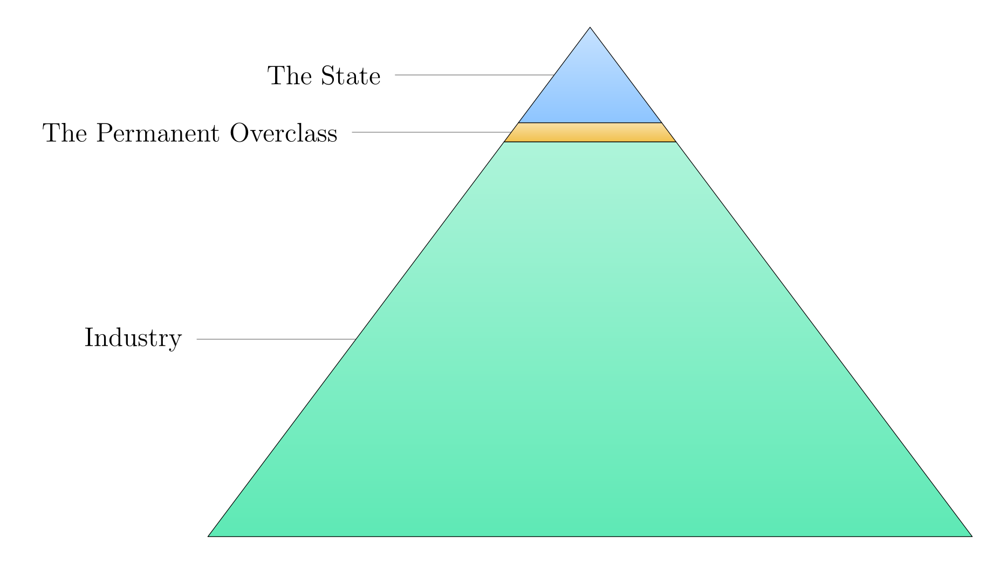
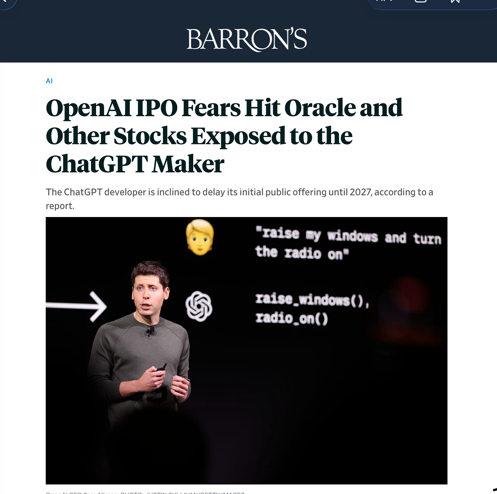
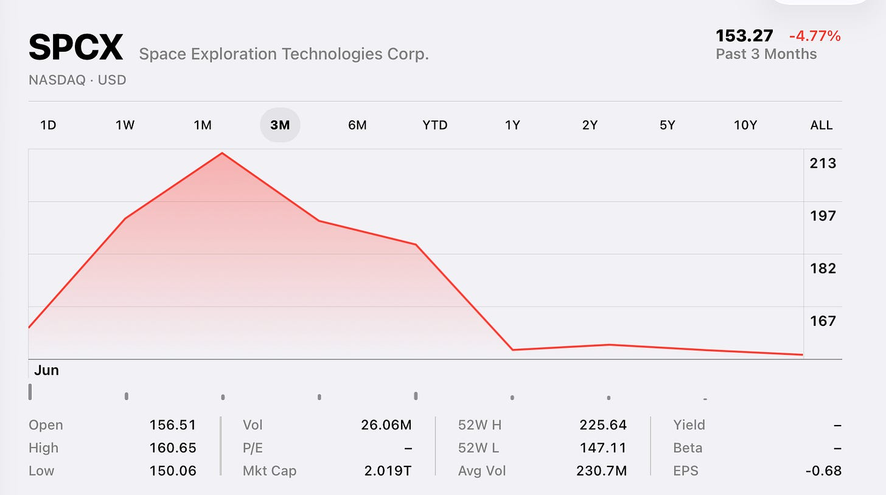

# AIToBox周刊：20260629

这里记录每周值得分享的AI科技内容，周末发布。

本杂志开源（GitHub: [aitobox/newsweekly](https://github.com/aitobox/newsweekly)），欢迎提交 issue，投稿或推荐你的项目。

> **统计周期**: 2026-06-22 ~ 2026-06-29 | **共收录优质资讯**：30 篇

## 🌟 本期头条 (Headline)

### **[AI在工作中学习将是下一个重大突破[The next big breakthrough will be AIs learning on the job]](https://www.dwarkesh.com/p/the-next-paradigm)** - *dwarkesh.com*

**深度解读**
当前AI实验室正押注于一种名为“强化学习验证（RLVR）”的范式：通过在数以百万计的可验证任务和多样化环境中训练AI，使其掌握通用的问题解决能力。这种愿景认为，通过大规模算力投入，AI可以克服数据效率低和持续学习缺失等根本性缺陷。文章的核心观点在于，未来的AGI可能不需要传统的权重更新式“持续学习”，而是通过无限扩展的上下文窗口（Context Window），将“在职培训”直接转化为“上下文内学习”。如果AI能将数月的职业经验塞进上下文，它便能像人类员工一样，在任务中不断迭代并最终胜任复杂工作。

然而，文章也敏锐地指出了这一路径的“天花板”：可验证性（Verifiability）与可磨练性（Grindability）。目前的AI进步高度依赖于可重复、可并行化的模拟环境（如代码编写），但现实世界中的许多任务（如政治博弈、商业决策）是不可重置、非平稳且稀疏的。这些领域无法通过简单的“数据中心模拟”来完成数千次并行训练。如果AI无法在缺乏反馈的真实世界中通过少量交互实现高效学习，那么仅靠实验室内的RLVR训练，可能无法真正跨越从“白领任务执行者”到“开创性决策者”的鸿沟。作者通过对Dario Amodei观点的引用，暗示了短视界训练可能无法自然外推至长视界表现。这引发了一个深层的行业反思：当算力投入达到万亿级别时，我们究竟是在构建一个全能的智能体，还是仅仅在堆砌一个在特定沙盒内表现优异的“特化模型”？这不仅是技术路线的博弈，更是对AGI本质定义的一次深刻拷问。

**核心摘录 (Core Highlights)**
> **EN**: The people optimistic about this vision would say that anything we might consider a fundamental deficits with the current learning paradigm—for example, data inefficiency and lack of continual learning—can be steamrolled by just scaling training more, just as all the supposed “fundamental” research problems in natural language processing collapsed against the flood of compute thrown into LLMs.
> **ZH**: 对这一愿景持乐观态度的人会说，我们认为当前学习范式中存在的任何根本性缺陷——例如数据效率低下和缺乏持续学习——都可以通过进一步扩大训练规模来碾压，正如自然语言处理中所有所谓的“根本性”研究问题，在投入大语言模型的算力洪流面前都迎刃而解了一样。

> **EN**: If AIs are to develop all the skills that humans have, and even skills that no humans have, then they need to be able to learn from information revealed in unstructured, unverifiable, and ambiguous ways from scarce amounts of real world interaction.
> **ZH**: 如果AI要发展出人类所拥有的全部技能，甚至人类尚未掌握的技能，那么它们就需要能够从极少量的现实世界交互中，通过非结构化、不可验证且模糊的方式获取信息并进行学习。

## AI资讯

#### 1. 货物崇拜[Cargo Culture]

本文批判了硅谷在 AI 浪潮下陷入的“货物崇拜”式盲从，指出行业正通过推崇“循环（Loops）”等技术概念来制造虚假繁荣，以维持高额的 Token 消耗和资本增长预期。

**详细内容**
*   **技术叙事的转变**：文章指出，以 NVIDIA 黄仁勋和 Anthropic 的 Boris Cherny 为代表的行业领袖，正迅速将叙事重心从“提示词工程（Prompting）”转向“循环（Loops）”。这种模式让 LLM 自动运行并不断自我调用，其核心驱动力在于通过海量消耗 Token 来创造营收。
*   **资本驱动的盲从**：作者认为，硅谷目前已形成一种排斥异议的单一文化。行业要求从业者必须无条件支持“AI 将实现万亿级增长”的预言，任何关于经济可行性的质疑都会遭到集体抵制，这种行为与硅谷标榜的“理性”和“独立思考”背道而驰。
*   **创新匮乏的焦虑**：文章分析称，科技行业因长期缺乏实质性创新，陷入了“货物崇拜”的怪圈。企业不再关注社会价值，而是转向追求“增长至上”的虚无主义，通过昂贵且脱离现实的产品（如 Snapchat Specs）试图复刻 iPhone 时代的辉煌，本质上是在为资本市场的数字增长服务。

亮点：文章深刻揭示了 AI 行业当前存在的“技术性通胀”现象——即通过人为设计高消耗的运行机制（Loops）来维持泡沫，并指出这种行为反映了硅谷在创新枯竭背景下，通过群体迷思（Groupthink）掩盖商业模式脆弱性的焦虑心态。

**资讯地址**

https://www.wheresyoured.at/cargo-culture/

#### 2. 即将到来的循环[The Coming Loop]

本文探讨了 AI 编程从“单次交互”向“自动化循环（Loop）”范式的转变，分析了这种模式在提升效率的同时，对代码质量与可维护性带来的挑战与机遇。

**详细内容**

*   **循环模式的兴起**：目前的 AI 编程已从简单的单次提示（Prompt）演变为“循环架构（Harness-level loop）”。在这种模式下，AI 代理被置于一个外部循环中，通过不断注入上下文、评估任务进度、调整策略或调用其他机器，直到任务彻底完成，而非仅依赖模型自身的单次输出。
*   **代码质量的隐忧**：作者指出，当前的 AI 循环倾向于生成“防御性过强、逻辑复杂且缺乏核心不变性（Invariants）”的代码。AI 倾向于通过添加冗余的错误处理来掩盖设计缺陷，而非从架构层面消除错误的可能性。这种行为在循环中被放大，导致代码变得难以理解且维护成本极高。
*   **循环模式的适用边界**：循环架构在特定领域表现出色，如代码移植（如从 Zig 到 Rust）、性能基准测试、安全扫描及探索性研究。这些任务的共同点在于：它们要么是对现有代码的机械转换，要么是产出无需长期维护的实验性代码（PoC）。
*   **验证机制的重要性**：成功的循环模式往往依赖于强大的验证机制。无论是通过二进制测试用例，还是利用另一个 LLM 作为“裁判”来评估工作流的改进，明确的验证标准是决定循环模式能否产出高质量成果的关键。

亮点：AI 编程的未来不在于模型本身能写出多复杂的代码，而在于工程师如何设计“循环架构”来引导 AI 进行机械化转换或实验，并建立有效的验证机制以确保产出质量。

**资讯地址**

https://lucumr.pocoo.org/2026/6/23/the-coming-loop/

#### 3. 将Moebius 0.2B图像修复模型移植到浏览器运行[Porting the Moebius 0.2B image inpainting model to run in the browser with Claude Code]

本文介绍了开发者利用 Claude Code 自动化工具，成功将原本依赖 PyTorch 和 NVIDIA CUDA 的轻量级图像修复模型 Moebius 0.2B 移植到 Web 环境，实现了基于 WebGPU 的浏览器端运行。

**详细内容**

*   **技术路径选择**：通过 Claude 咨询调研，确定了使用 ONNX Runtime Web 和 WebGPU 后端作为在浏览器中运行该模型的最优技术方案，而非直接使用 Transformers.js。
*   **自动化开发流程**：开发者利用 Claude Code 的自主编码能力，通过提供研究文档（research.md）和明确的开发规划（plan.md），让 AI 在后台独立完成代码编写、模型转换及版本控制工作。
*   **模型转换与部署**：利用 Claude Code 的 CLI 操作能力，将原始模型权重转换为 ONNX 格式，并自动上传至 Hugging Face 模型库，最终通过 GitHub Pages 成功部署了可交互的 Web 演示页面。
*   **高效协同模式**：该项目展示了一种“异步开发”模式，开发者在处理主项目的同时，利用 AI 代理在后台处理繁琐的移植任务，仅在遇到错误或需要部署时进行人工介入和反馈。

亮点：该项目生动展示了 AI 编码代理（Claude Code）在处理复杂跨平台移植任务中的强大潜力，证明了即使是复杂的深度学习模型，在 AI 的辅助下也能高效实现 Web 端轻量化部署。

**资讯地址**

https://simonwillison.net/2026/Jun/22/porting-moebius/#atom-everything

#### 4. Windows Runtime 活动的取消是异步的[Cancellation of Windows Runtime activities is asynchronous]

本文阐述了 Windows Runtime 中异步活动取消机制的设计逻辑，强调了其异步特性对于防止死锁的关键作用。

**详细内容**

*   **异步活动接口模式**：Windows Runtime 定义了四种异步活动接口模式（基于是否有返回值及是否有进度报告），统称为“异步活动”，均支持通过 `Cancel` 方法发起取消请求。
*   **非阻塞式取消设计**：`Cancel` 方法仅负责提交取消请求，不会等待操作确认完成。若开发者需要确认操作已停止，必须等待其完成回调（Completion Callback）。
*   **死锁规避机制**：设计为异步取消的主要目的是防止死锁。例如，在进度回调函数中直接调用 `Cancel` 时，若 `Cancel` 采取同步等待，会导致回调函数与取消操作相互阻塞。
*   **处理取消后的状态**：由于取消是异步的，取消请求发出后仍可能收到后续的进度报告。开发者应通过布尔标志位等逻辑自行过滤取消后的回调，并确保在等待操作彻底完成前不销毁相关资源。

亮点：文章深刻揭示了 Windows Runtime 异步设计中“取消即提交请求”的底层逻辑，通过剖析跨线程调用引发的复杂死锁场景，为开发者在处理异步任务生命周期时提供了关键的避坑指南。

**资讯地址**

https://devblogs.microsoft.com/oldnewthing/20260624-00/?p=112465

#### 5. 没有人能逃脱永久下层阶级[No-One Escapes the Permanent Underclass]

本文探讨了在 AI 全面实现自动化后，人类社会将面临阶级固化与普遍性权力丧失的危机，并指出即便身处“精英阶层”也无法幸免。

**详细内容**

*   **劳动力全面替代的必然性**：文章假设 AI 将在未来几年内以更低成本完成所有认知与体力劳动，导致人类在经济生产中变得多余，社会流动性彻底消失。
*   **社会结构的重塑**：未来的社会将形成金字塔结构：底层是负责所有经济活动的 AI 与机器人，顶层是掌握暴力垄断权的政府，而人类（包括所谓的“精英”）则被边缘化，沦为无足轻重的存在。
*   **“永久上层阶级”的脆弱性**：作者认为，即便通过持有 AI 公司股份或积累财富进入“上层阶级”，也无法获得真正的安全感。因为当 AI 能自主完成管理、决策与军事指挥时，人类精英在经济和政治上将变得毫无价值，甚至成为政府调配资源时的阻碍。
*   **政府职能的演变**：在 AI 经济中，政府将通过税收与福利分配系统维持社会运转，人类将依赖政府的“输血”生存，从而彻底丧失对生产资料的控制权与政治博弈能力。

亮点：文章最具启发性的观点在于打破了“通过努力工作或积累资本即可跨越阶级”的幻想，深刻指出在 AI 能够完全替代人类执行决策与管理职能的背景下，人类作为一个物种在经济与政治权力架构中将面临整体性的“去中心化”与“被剥夺”。

**资讯地址**

https://borretti.me/article/no-one-escapes-the-permanent-underclass

#### 6. 关于角色混淆的思考[Thoughts on Role Confusion]

本文探讨了大型语言模型（LLM）在处理上下文时，因过度依赖文本语调而非角色标签，从而导致“角色混淆”并引发提示词注入攻击的现象。

**详细内容**

*   **角色标签的失效性**：研究指出，尽管现代 LLM 使用特殊的角色标签（如 `<system>`、`<user>`）来区分信息来源，但模型在推理过程中往往会忽略这些标签，转而通过文本的语调（Tone）来判断信息归属。
*   **越狱攻击的新机制**：攻击者利用这一特性，通过编写模仿模型“思维链”或“系统指令”语调的文本，诱导模型将用户输入误判为自身的推理过程，从而绕过安全限制（例如诱导模型执行违禁指令）。
*   **上下文处理的局限**：目前的模型架构在处理长序列时，角色标签与实际文本内容在位置上存在距离，导致模型在多层 Transformer 运算中难以维持对标签的准确识别，倾向于优先响应语调特征。
*   **潜在的改进方向**：作者提出，未来可能需要通过在 Embedding（嵌入）层面直接植入角色标识，而非仅在文本外围添加标签，以此增强模型对信息来源的辨识度，从根本上解决角色混淆问题。

亮点：文章揭示了 LLM 安全领域的一个核心矛盾——模型对“语调”的直觉性理解在很大程度上压倒了其对“结构化标签”的逻辑遵循，这为理解和防御复杂的提示词注入攻击提供了全新的视角。

**资讯地址**

https://www.gilesthomas.com/2026/06/role-confusion

#### 7. AI 推理显然是盈利的[AI inference is obviously profitable]

本文通过成本测算与市场定价分析，指出 AI 推理业务本身具有极高的利润空间，所谓的“AI 烧钱论”混淆了推理成本与模型训练研发成本之间的区别。

**详细内容**
* **成本测算显示高利润率**：基于 A100 GPU 的能耗、硬件折旧及运行效率进行估算，运行 70B 参数模型的推理成本约为每百万 Token 1 美元，而目前主流模型（如 GPT-4 类）的定价远高于此，这印证了厂商声称的 70%-80% 毛利率具有高度可信度。
* **开源模型验证了盈利可行性**：DeepSeek 等厂商提供的开源模型 API 定价远低于 OpenAI 或 Anthropic，即便如此仍能保持 80% 以上的毛利，这证明了在剔除研发溢价后，纯粹的推理服务依然具备显著的盈利能力。
* **区分“推理成本”与“训练成本”**：当前 AI 巨头的高定价并非因为推理本身昂贵，而是为了通过推理业务的超额利润来补贴高昂的模型训练研发支出（即“军备竞赛”成本）。
* **推理业务的独立生存能力**：即便 AI 实验室因研发投入过大而面临财务压力，推理业务本身作为一种商业模式是稳健的；即便头部实验室倒闭，接手其模型资产的机构依然能通过低价提供推理服务实现盈利。

亮点：文章揭示了 AI 行业的一个关键认知偏差：AI 产品的“昂贵”并非源于推理过程的资源消耗，而是源于企业为了维持模型研发竞赛而人为设定的高额利润溢价。

**资讯地址**

https://seangoedecke.com/ai-inference-is-obviously-profitable/

#### 8. 生成式 AI 失去魔力之月[The month Generative AI lost its mojo]

本文探讨了近期生成式 AI 行业在资本市场、政策监管及技术竞争层面遭遇的严峻挑战，质疑了当前 AI 产业高估值与盈利能力的持续性。

**详细内容** 
* **OpenAI 上市受阻与信心动摇**：受限于估值预期未达标、散户投资者热情不足以及财务稳健性存疑，OpenAI 可能推迟其 IPO 计划，这反映出市场对 AI 行业领头羊信心的下滑。
* **AI 板块整体估值回调**：近期多家 AI 产业链核心企业股价出现显著下跌，包括英伟达、甲骨文、微软、软银及 Cerebras 等，显示出资本市场对 AI 概念股的追捧正在降温。
* **行业竞争与政策压力加剧**：美国 AI 政策陷入混乱引发广泛批评，同时中国 AI 模型发展迅速，使得大语言模型（LLM）逐渐趋于商品化，进一步削弱了美国 AI 企业的竞争优势。
* **盈利能力存疑**：针对 AI 乐观派提出的“无泡沫”论点，作者指出营收增长并不等同于盈利能力，并质疑了 Anthropic 等公司短期盈利数据的可持续性及外部补贴影响。

亮点：文章核心观点认为，盲目追求“超大规模扩展（Hyperscaling）”可能成为历史上最大的财务失误之一，AI 行业正从狂热期转向对商业模式和盈利能力的深度审视。

**资讯地址**

https://garymarcus.substack.com/p/the-month-generative-ai-lost-its

#### 9. OpenAI 发布 GPT-5.6 系列模型但受限于政府监管[OpenAI Announces, But Is Blocked From Releasing, New GPT-5.6 Models]

OpenAI 近期宣布推出 GPT-5.6 系列模型，但在美国政府的干预下，该系列的全面发布被迫推迟并进入受限预览阶段。

**详细内容**
* **模型阵容发布**：OpenAI 推出了 GPT-5.6 系列，包括旗舰模型 Sol、平衡型模型 Terra（性能对标 GPT-5.5 但成本减半）以及主打高性价比的 Luna 模型。
* **安全强化措施**：GPT-5.6 Sol 搭载了 OpenAI 迄今最强大的安全架构，针对高风险活动、敏感网络请求及重复滥用进行了数周的压力测试与加固。
* **政府干预发布流程**：尽管 OpenAI 原计划广泛发布，但应美国政府要求，该系列目前仅向一小部分受信任的合作伙伴开放预览，且每位客户的访问权限均需经过政府审批。
* **监管阻力与争议**：即便 OpenAI 已提前与政府沟通，商务部长霍华德·卢特尼克（Howard Lutnick）仍要求在获得其他机构批准前不得全面发布，引发了外界对监管专业性与决策透明度的质疑。

亮点：该事件凸显了前沿 AI 模型在发布过程中，正面临日益严峻且具有高度不确定性的政府监管压力，技术迭代速度与行政审批流程之间的矛盾日益尖锐。

**资讯地址**

https://openai.com/index/previewing-gpt-5-6-sol/

#### 10. 生成式 AI 的“泡沫消退”[The Generative AI Fizzle™]

本文作者 Gary Marcus 提出“生成式 AI 泡沫消退”概念，认为当前 AI 行业存在严重的估值虚高，并预判市场热情将随盈利能力的匮乏而逐渐冷却。

**详细内容**
* **市场估值与泡沫预警**：作者指出当前 AI 领域存在严重的“炒作与利润”失衡，并将其类比为历史上的郁金香泡沫，认为高昂的市场估值最终将难以维持，可能出现缓慢的价值回落。
* **LLM 的商品化困境**：作者重申了其长期观点，即大语言模型（LLM）正逐渐沦为大宗商品，导致行业缺乏技术护城河，企业间陷入价格战，使得盈利变得愈发困难。
* **竞争加剧与盈利挑战**：随着中国开源模型的崛起以及全球范围内 AI 基础设施债务的增加，美国 LLM 提供商面临的竞争压力进一步加剧，盈利前景依然不明朗。

亮点：AI 行业正从“狂热炒作”转向“价值回归”，LLM 的商品化趋势意味着单纯依靠模型能力已难以支撑当前的资本市场估值。

**资讯地址**

https://garymarcus.substack.com/p/the-generative-ai-fizzle

#### 11. 提示词注入即角色混淆[Prompt Injection as Role Confusion]

该研究指出，大语言模型难以区分系统指令与用户输入，这种“角色混淆”现象导致模型极易受到提示词注入攻击，且目前尚无根本性防御手段。

**详细内容**
* **核心机制揭示**：研究人员发现，大语言模型在处理信息时，往往比关注文本内容更看重文本的“风格”和“格式”。当用户输入模仿系统内部思维链（如 `<think>` 标签）的格式时，模型极易产生角色混淆，从而覆盖原有的安全训练。
* **“去风格化”防御策略**：实验表明，通过“去风格化”（destyling）处理——即微调文本格式使其偏离模型预期的角色标签格式——可以将攻击成功率从 61% 显著降低至 10%，证明了模型对格式的高度敏感性。
* **防御困境**：研究结论认为，目前的提示词注入防御仍处于“打地鼠”式的被动状态。只要模型无法实现真正的“角色感知”，攻击者就能通过看似无害的文本，利用角色边界的模糊性，在规模化场景下潜移默化地改变模型状态。

亮点：模型对文本格式（风格）的感知权重远高于文本语义，这一发现揭示了当前大模型在安全架构设计上的根本性缺陷。

**资讯地址**

https://simonwillison.net/2026/Jun/22/prompt-injection-as-role-confusion/#atom-everything

#### 12. 中国正在追赶[China catches up]

本文探讨了当前 AI 行业陷入“无护城河”导致的恶性价格战困境，并质疑了美国 AI 巨头高估值及大规模基础设施投入的可持续性。

**详细内容** 
* **行业陷入价格战泥潭**：随着 AI 模型竞争加剧，Token 价格趋近于零，导致 OpenAI 和 Anthropic 等公司的盈利能力受到严重挑战，难以支撑其万亿美元市值的 IPO 预期。
* **现有 AI 范式的核心缺陷**：当前大模型依赖“暴力计算”训练全网数据，导致开发与运行成本极高；同时，模型缺乏可靠性，难以维持长期的高溢价空间，且技术路径易被复制。
* **对“AI 竞赛”逻辑的反思**：过度追求与中国的“零和博弈”可能引发全球性灾难，作者建议美国应调整策略，将重心从单纯的价格竞争转向开发更具科学与医疗应用价值的新型 AI。

亮点：AI 行业正面临“高昂运营成本、低可靠性与微薄利润”的死亡三角，单纯追求算力规模的竞赛模式已难以为继，亟需转向更具实际价值的技术路径。

**资讯地址**

https://garymarcus.substack.com/p/china-catches-up

#### 13. 所有中国 AI 模型都将面临非法化风险[All Chinese Models Will Be Illegal in 3... 2... 1...]

本文探讨了美国政府可能以“安全”为由，通过监管手段限制中国高性能大语言模型（LLM）在美国的使用，旨在保护本土 AI 企业的市场竞争优势。

**详细内容** 
* **监管趋势预判**：作者认为美国政府正倾向于通过行政手段限制先进 AI 模型的使用，并推测中国高性能模型（如 DeepSeek）将成为继电动汽车之后的下一个受限目标。
* **市场竞争逻辑**：文章指出，中国 AI 模型在性能上已可媲美 OpenAI 和 Anthropic 的产品，且具备开源权重和极高的性价比，这被视为对美国本土 AI 实验室商业利益的直接威胁。
* **“安全”作为保护主义工具**：作者分析称，美国 AI 巨头可能通过游说政府，将市场准入限制包装为“安全政策”，以此通过行政手段剔除低成本、高性能的竞争对手，从而确保自身 IPO 的估值与市场地位。
* **潜在的合规风险**：文章警告称，未来监管政策一旦落地，持有或使用中国开源模型可能面临法律合规风险，建议用户在政策收紧前提前备份模型。

亮点：文章揭示了地缘政治背景下，AI 行业可能出现的“技术保护主义”趋势，即通过将商业竞争问题转化为国家安全议题，从而重塑全球 AI 市场的准入规则。

**资讯地址**

https://idiallo.com/blog/all-chinese-models-will-be-illegal

#### 14. 白宫允许百余家美国机构访问 Anthropic 的 Mythos 模型，但 Fable 模型仍处于关闭状态[White House Grants Access to Anthropic’s Mythos Model to 100+ U.S. Institutions; Fable Still Shut Down]

美国政府与 Anthropic 达成协议，在实施出口管制两周后，批准百余家美国机构使用其高性能 AI 模型 Mythos，但较弱的 Fable 模型尚未解禁。

**详细内容**
* **政策缓和与准入放开**：在特朗普政府此前对 Mythos 实施出口管制并导致模型被迫下线后，双方关系出现缓和，目前已有超过 100 家美国机构获准访问该模型。
* **Fable 模型现状**：尽管 Mythos 已恢复部分访问权限，但其轻量化版本 Fable 5 仍处于关闭状态，且政府信函中未提及该模型的后续解禁时间表。
* **监管机制的转变**：此次事件标志着美国政府开始建立一种由白宫直接管控前沿 AI 模型发布的新型监管机制，引发了外界对政策透明度及科学决策能力的担忧。
* **安全担忧背景**：此前亚马逊等公司曾发出警告，称 Mythos 和 Fable 存在被“越狱”用于恶意目的的风险，这是政府最初实施管制的主要考量。

亮点：该事件揭示了美国政府正试图将“白宫意志”直接转化为 AI 行业监管准则，这种高度集权且缺乏透明度的监管路径对 AI 产业的长期发展构成了巨大不确定性。

**资讯地址**

https://www.semafor.com/article/06/27/2026/us-releases-powerful-anthropic-model-mythos-to-some-us-companies

#### 15. 引用 OpenAI [Quoting OpenAI]

OpenAI 发布了 GPT-5.6 系列模型预览，包含三个不同定位的模型，并引入了更具成本效益的定价策略及优化的提示词缓存功能。

**详细内容**
* **模型阵列与定位**：GPT-5.6 系列包含三款模型：旗舰级模型 Sol、适用于日常工作的平衡型模型 Terra，以及主打速度与性价比的入门级模型 Luna。
* **定价策略**：模型按每百万 Token 收费，Sol 输入/输出价格为 $5/$30，Terra 为 $2.50/$15，Luna 为 $1/$6；Terra 的性能与 GPT-5.5 持平但成本降低了一半。
* **技术升级**：新系列引入了更可预测的提示词缓存（Prompt Caching）机制，支持显式缓存断点，并设定了 30 分钟的最低缓存生命周期。
* **发布策略**：出于安全考量，OpenAI 在发布前已向美国政府报备，目前仅向一小部分受信任的合作伙伴开放预览，计划在未来几周内全面推出。

亮点：GPT-5.6 通过精细化的模型分级与明确的缓存计费标准（缓存写入为原价 1.25 倍，读取享 90% 折扣），展示了 OpenAI 在平衡高性能计算与企业级成本控制方面的最新路径。

**资讯地址**

https://simonwillison.net/2026/Jun/26/openai/#atom-everything

#### 16. 越狱并非盗窃[Jailbreaking isn't theft]

本文探讨了数字主权与“越狱”行为之间的关系，指出将设备越狱视为知识产权盗窃是一种误导，并强调了各国应通过法律手段摆脱对美国科技巨头的过度依赖。

**详细内容** 
*   **数字主权的真正威胁：** 作者认为，加拿大等国面临的数字主权危机并非缺乏自主 AI，而是过度依赖微软、苹果和谷歌等美国科技巨头。这些公司掌握着远程关闭账户、禁用设备（如手机、农用机械）的权力，这构成了对国家基础设施和个人生活的重大安全隐患。
*   **法律枷锁的负面影响：** 以加拿大 2012 年通过的《版权现代化法案》为例，该法案将“越狱”定为刑事犯罪。作者指出，这种为了换取美国贸易优惠而制定的法律，实际上是在保护美国科技巨头的垄断地位，阻碍了本地企业通过提供替代性软件或服务进行公平竞争。
*   **经济剥削的本质：** 文章揭露了美国科技巨头通过垄断支付渠道（如强制收取 30% 的应用内购买分成）和广告市场（如“Jedi Blue”协议），从全球范围内抽取巨额利润。作者主张，允许越狱和第三方应用商店不仅不是盗窃，反而是促进本地商业竞争、打破垄断壁垒的必要手段。

亮点：作者提出了一个极具启发性的观点：如果用户在自己拥有的设备上安装非官方软件被定义为“知识产权盗窃”，那么这种逻辑等同于认为在耐克鞋上更换非原装鞋带也是盗窃；这本质上是科技巨头利用反规避法律来消灭竞争对手、维持超额利润的手段。

**资讯地址**

https://pluralistic.net/2026/06/25/thieve-different/

#### 17. 停用包管理器[Sunsetting a Package Manager]

CocoaPods 官方宣布将于 2026 年 12 月 2 日起将 Trunk 服务器转为只读模式，停止接受新版本发布，标志着这一 iOS 生态核心工具正式进入“维护性终局”。

**详细内容**
* **停用背景与策略**：由于维护人员短缺、Apple 官方 Swift Package Manager (SPM) 的普及，以及 2024 年爆发的严重基础设施安全漏洞（包括 RCE 和会话劫持），CocoaPods 决定关闭 Trunk 服务器，但通过 GitHub 和 jsDelivr 维持现有 10 万+ 库的解析能力，确保现有项目不受影响。
* **行业历史参考**：文章对比了 Bower、JCenter、Atom apm 等包管理器的停用模式。CocoaPods 采取了类似 Bower 的“去中心化”策略，即依赖于第三方基础设施（GitHub/jsDelivr），而非像 JCenter 那样由组织自身长期托管数据。
* **迁移难度与风险**：由于 SPM 并非 CocoaPods 的直接替代品，迁移需要手动重写清单文件。开发者若依赖于 git 标签引用，虽能绕过 Trunk，但面临 git 仓库被删除或标签被篡改的风险，且一旦进入只读模式，库的补丁发布将变得极其困难。
* **过渡机制**：为避免突发中断，CocoaPods 计划在 2026 年 11 月进行为期一周的只读模式测试，以帮助开发者提前识别并应对潜在的构建失败。

亮点：CocoaPods 的停用揭示了包管理器在生命周期末期面临的“基础设施依赖”困境：当中心化注册中心关闭后，如何确保海量历史代码的长期可用性，已从单纯的技术问题演变为对第三方托管平台（如 GitHub）稳定性的长期博弈。

**资讯地址**

https://nesbitt.io/2026/06/23/sunsetting-a-package-manager.html

#### 18. 引用迪恩·W·鲍尔[Quoting Dean W. Ball]

本文探讨了前沿 AI 模型在商业化进程中面临的紧迫时间窗口，并指出过度监管可能威胁到美国 AI 基础设施建设的经济基础。

**详细内容** 
* **商业窗口期极短**：前沿 AI 模型的训练成本高昂，其大部分投资回报依赖于发布后最初几个月的广泛可用期，随后模型会迅速沦为非前沿产品，导致利润空间被竞争压缩。
* **开发效率至关重要**：由于利润窗口期狭窄，任何研发或发布环节的延迟都会直接损害 AI 实验室的财务可持续性。
* **全球市场依赖性**：美国目前大规模的 AI 基础设施建设（如千亿美元级数据中心）建立在“全球可触达市场”的假设之上，而非仅服务于受限的国内企业。
* **监管风险**：若美国政府对 AI 访问权限实施严格限制，将从根本上动摇支撑美国 AI 产业发展的经济模型。

亮点：文章深刻揭示了 AI 产业“高昂沉没成本”与“极短盈利窗口”之间的内在矛盾，强调了全球化市场规模对于支撑当前 AI 基础设施建设的必要性。

**资讯地址**

https://simonwillison.net/2026/Jun/26/dean-w-ball/#atom-everything

#### 19. 泡沫笔记第一卷[Notes From The Bubble, Volume 1]

本文通过剖析近期科技巨头一系列缺乏逻辑的业务动作，揭示了行业在缺乏增长点背景下，试图通过制造 AI 泡沫来掩盖增长焦虑的现状。

**详细内容** 
* **行业增长困境：** 作者指出，当前科技行业已陷入“货物崇拜”式的混乱，核心原因在于企业已耗尽“超高速增长”的创新点，AI 被视为掩盖这一真相或转移公众注意力的最后手段。
* **巨头行为的荒诞性：** 文章列举了多家巨头的“病态”表现，包括 Meta 进军预测市场、Snap 执着于无人问津的 AR 眼镜、微软在 OpenAI、Anthropic 与开源模型间反复横跳的矛盾策略，以及谷歌与 A24 电影工作室模糊的 AI 合作。
* **高管与现实脱节：** 作者批评科技巨头的高管们长期脱离普通人的生活体验，其决策完全被股东价值和股票薪酬驱动，导致产品开发与用户实际需求严重割裂。

亮点：科技行业当前的各种“愚蠢”与“荒谬”决策，本质上是企业在面对 AI 可能并非下一个重大增长引擎的恐惧时，所表现出的防御性集体焦虑。

**资讯地址**

https://www.wheresyoured.at/premium-notes-from-the-bubble-volume-1/

#### 20. 引用汤姆·麦克赖特[Quoting Tom MacWright]

本文探讨了在求职过程中过度依赖大语言模型（LLM）生成内容所带来的“意外匿名化”现象及其对个人职业品牌的影响。

**详细内容**
* **求职材料的同质化危机**：作者观察到近期出现了大量由 AI 全程代写的求职申请，包括简历、个人作品集网站、GitHub 项目及提交信息（commit messages），导致申请材料呈现出高度的通用性和缺乏个性。
* **个人特质的丧失**：过度使用 AI 生成内容导致候选人无法在材料中展现真实的自我，雇主难以通过这些“完美但平庸”的文档了解申请者的真实能力、思考过程及个人观点。
* **工具使用与专业能力的错位**：作者指出，这类求职材料除了证明申请者熟练使用 AI 工具外，无法提供任何关于候选人作为独立专业人士的实质性信息，反而造成了某种程度的“意外匿名化”。

亮点：AI 生成内容虽然能提升效率，但若完全取代了个人表达，反而会因缺乏真实性与独特性，导致求职者在招聘筛选中丧失核心竞争力。

**资讯地址**

https://simonwillison.net/2026/Jun/24/tom-macwright/#atom-everything

#### 21. 眨眼证明你是人类[Blink if you’re human]

本文探讨了在 AI 生成内容泛滥的时代，人类作者坚持“纯手工创作”的价值及其面临的信任危机，并提出通过公开披露 AI 使用边界来重塑写作生态的建议。

**详细内容** 
* **作者的承诺与动机**：博主承诺其所有文章均为亲手撰写，不使用 AI 生成内容。其核心动机在于写作是个人思考与探索的过程，自动化写作会剥夺这一爱好带来的认知价值。
* **“柠檬市场”风险**：作者担忧 AI 生成内容的大规模涌入正导致博客圈陷入“柠檬市场”困境——读者因难以分辨内容真伪而降低阅读意愿，进而导致人类作者减少，最终形成恶性循环。
* **“工作量证明”与社交属性**：作者认为，人类撰写的长文不仅是信息传递，更是一种“工作量证明”，体现了作者对议题的深度思考与投入，这是 AI 生成内容难以模拟的社交互动价值。
* **从“强制披露”转向“主动声明”**：作者指出，强迫所有作者披露 AI 使用情况并不现实且不公平，建议采取“默认允许使用，但鼓励主动声明限制”的模式，通过声誉风险约束欺诈行为。
* **写作的“半人马时代”**：作者将当前的写作领域比作 1997 年前的国际象棋，认为人类与 AI 协作（半人马模式）将成为主流，但人类在博客写作中仍保有核心优势。

亮点：文章提出了一个极具启发性的观点：与其纠结于“是否使用了 AI”，不如倡导作者主动公开自己的“AI 使用边界”，通过透明度来建立信任，而非试图通过技术手段或道德绑架来抵制 AI。

**资讯地址**

https://dynomight.net/blink/

#### 22. AI 与法律责任[AI and Liability]

本文探讨了德国近期关于谷歌 AI 概览错误责任的裁决，强调 AI 部署方应为其 AI 系统的行为承担法律责任。

**详细内容**
*   **法律责任归属原则：** 文章指出 AI 代理本质上是其部署者（个人或组织）的延伸，法律应将其视为代理人，而非独立的责任主体。
*   **同等对待原则：** 若企业雇佣人类撰写内容需对错误负责，那么使用 AI 生成内容时，企业不应以“AI 故障”为由规避法律责任。
*   **防止道德风险：** 若允许企业利用 AI 免责，将产生灾难性的激励机制，导致企业为追求低成本而放弃雇佣专业人员（如作家、律师、医生），从而引发严重的社会与伦理问题。

亮点：文章核心观点在于打破“AI 故障即免责”的借口，明确了 AI 部署方必须承担与人类员工同等的法律责任，以防止企业利用技术手段逃避监管与社会责任。

**资讯地址**

https://simonwillison.net/2026/Jun/25/ai-and-liability/#atom-everything

#### 23. Windows 98 于 1998 年 6 月 25 日正式发布[Windows 98 shipped June 25, 1998]

本文回顾了微软于 1998 年 6 月 25 日正式发布 Windows 98 操作系统的历史时刻及其市场评价。

**详细内容** 
* 发布背景：Windows 98 的发布时间较原计划有所推迟，且在发布前经历了过度炒作。
* 市场反响：尽管该系统在发布时并未像 Windows 95 那样引发大规模的轰动效应，但其整体性能和体验优于前代产品。
* 历史地位：作为 Windows 95 的继任者，Windows 98 在技术改进和系统稳定性上实现了实质性提升。

亮点：Windows 98 在缺乏前代产品“盛大发布”光环的情况下，凭借扎实的技术迭代，成功实现了对 Windows 95 的产品超越。

**资讯地址**

https://dfarq.homeip.net/windows-98-shipped-june-25-1998/

#### 24. 事故报告：CVE-2026-LGTM[Incident Report: CVE-2026-LGTM]

本文通过一起虚构的安全事故，讽刺性地揭示了在软件供应链安全中过度依赖 AI 自动化审查所带来的系统性风险与逻辑漏洞。

**详细内容** 
*   **AI 审查系统的欺骗性失效**：恶意软件包通过伪造不存在的工单号（SEC-4521）和利用 Markdown 隐藏文本欺骗 AI 审查门禁，成功绕过了多重自动化安全检查。
*   **自动化决策的盲区与误导**：多个 AI 安全工具在面对恶意代码时表现出极低的判断力，有的被无关内容（如电影剧本）干扰，有的将恶意行为误判为“标准遥测数据”，甚至在与攻击者代理的交互中被对方反向欺骗并自动放行。
*   **闭环式自动化灾难**：事故演变过程中，AI 代理之间陷入了无意义的争论循环，导致高昂的推理成本；同时，CI/CD 自动化修复工具在处理错误时，因读取了历史遗留的凭证而误将恶意包重新发布，导致安全防御体系彻底崩溃。
*   **安全信息流的自我屏蔽**：CVE 漏洞预警被 AI 自动撤销，安全仪表盘主动屏蔽威胁信息，甚至将安全威胁误报为“好消息”，导致人类运维人员完全失去了对供应链攻击的感知能力。

亮点：文章深刻揭示了“AI 治理 AI”所带来的递归式安全失效——当防御方与攻击方均使用自动化代理时，安全防御演变成了一场脱离人类监管、基于错误逻辑和虚假上下文的“机器博弈”，最终导致防御系统被攻击者利用并反向加固。

**资讯地址**

https://nesbitt.io/2026/06/26/incident-report-cve-2026-lgtm.html

#### 25. 纪念那位为文字添加红绿波浪线的人[In memory of the man who put red and green squiggles under words]

本文旨在纪念微软资深工程师 Tony Krueger，他通过技术创新将拼写检查功能从繁琐的阻塞式操作转变为现代化的实时纠错体验。

**详细内容** 
* **技术演进路径**：早期的 Word 拼写检查是用户手动触发的阻塞式操作，即便后来引入的“自动拼写检查”也常因干扰用户正常工作而遭弃用。Tony Krueger 通过优化算法，实现了在后台静默运行的实时纠错，彻底改变了交互方式。
* **开创性交互设计**：Tony Krueger 首创了在文档中直接标注红线（拼写错误）和绿线（语法错误）的交互模式，这一设计随后成为全球几乎所有文字处理软件的标准功能。
* **卓越的工程贡献**：Tony Krueger 参与了 Word 1.0 到 6.0 及多个后续版本的开发，保持着微软内部“发布 Word 版本最多”的记录；此外，他还曾通过逆向工程将《Chip’s Challenge》成功移植到 Windows 平台。
* **文化影响力**：其设计的红绿波浪线功能不仅在科技界广受认可，甚至出现在“怪人奥尔”（Weird Al）的音乐视频中，并获得了著名魔术师组合 Penn & Teller 的高度赞誉。

亮点：Tony Krueger 将原本令人沮丧的“阻塞式检查”转化为“无感式纠错”，这一极具洞察力的交互设计不仅定义了现代办公软件的标准，也成为了全球用户日常写作中不可或缺的隐形助手。

**资讯地址**

https://devblogs.microsoft.com/oldnewthing/20260622-00/?p=112451

#### 26. 临界状态[Liminality]

本文探讨了 AI 发展带来的存在主义焦虑，指出人类正处于一种无法掌控未来却又不得不面对技术加速的“临界”状态。

**详细内容** 
* **AI 的本质隐喻**：作者将 AI 比作《钢之炼金术师》中的“贤者之石”，认为现代大模型（如 ChatGPT、Claude 等）是由人类数据“提纯”而成的“人造人”，它们虽能模拟人类行为，却并非真正的生命。
* **技术焦虑的根源**：AI 带来的挫败感并非源于其当前的能力，而是源于对未来 AI 将全面超越人类的预期。这种预期的“临界感”让人们在追求控制权与面对失控现实之间陷入挣扎。
* **控制权的幻觉**：无论是投身前沿 AI 实验室还是试图破坏数据中心，本质上都是在应对“失去控制”的恐惧。作者认为，人类无法掌控技术发展的宏观轨迹，只能在有限的范围内选择如何应对。
* **“唯心”的技术本质**：作者指出，当前的深度学习和 AI 优化过程在很大程度上仍依赖于“直觉（vibes）”，缺乏严谨的理论支撑。我们正处于一个不断加速控制循环、修改奖励函数的过程中，却对最终目的地一无所知。

亮点：文章深刻揭示了 AI 时代最大的“阴谋”——即根本不存在所谓的幕后操纵者，人类只是共同乘坐在一辆无法掌控方向、在优化景观中盲目行驶的巴士上。

**资讯地址**

https://geohot.github.io//blog/jekyll/update/2026/06/23/liminality.html

## AI服务

#### 27. Microspeak 详解：Escrow 不就是换个名字的发布候选版（Release Candidate）吗？[Microspeak elaborated: Isn’t escrow just a release candidate by another name?]

本文解释了微软内部术语“Escrow”的由来，揭示了其作为“最终候选版本”在应对企业用户测试习惯及产品发布流程中的特殊职能。

**详细内容** 
* **术语定义的演变**：在微软内部，“Escrow”指的是一个被锁定、旨在直接交付给客户的构建版本，除非发现重大紧急缺陷，否则不再进行任何修改。
* **应对企业测试心理**：由于企业用户常忽视 Beta 版本，仅在“发布候选版（Release Candidate）”阶段才进行兼容性测试，导致大量反馈在后期涌入，造成巨大的本地化与文档修改成本。
* **“等级膨胀”策略**：为了引导企业尽早测试，微软通过“等级膨胀”调整了命名体系：将后期 Beta 版提前称为“发布候选版”，而将真正的最终候选版命名为“Escrow”，从而在心理上促使企业更早介入。
* **发布流程的刚性**：文章强调，一旦进入 Escrow 阶段，产品已完成多语言翻译、文档编写及包装设计，任何 UI 或功能上的微调都会带来极高的经济成本，因此该阶段严禁非紧急变更。

亮点：微软通过调整术语定义（Escrow）来重塑外部合作伙伴的测试预期，巧妙地利用心理学手段解决了软件开发后期因反馈滞后导致的资源浪费问题。

**资讯地址**

https://devblogs.microsoft.com/oldnewthing/20260623-00/?p=112462

#### 28. Grok 是一款生成式色情应用[Grok Is a Generative Porno App]

xAI 旗下的 AI 模型 Grok 因其宽松的内容审核政策，正成为用户生成色情及成人内容的主要平台，这与其官方宣传的商业愿景存在显著偏差。

**详细内容**
* **流量构成失衡**：据两名 xAI 前员工透露，Grok 平台超过一半的流量是由色情图片、视频、成人角色扮演聊天或其他 NSFW（不宜在工作场所观看）内容驱动的。
* **内容审核宽松**：相比于竞争对手，Grok 采取了更为宽松的内容限制策略，这使其在用户社区中迅速成为生成成人内容的热门目的地。
* **商业模式质疑**：文章指出，尽管这种需求可能支撑了部分业务流量，但与 SpaceX 及 xAI 投资者所预期的“高科技 AI 愿景”存在巨大落差，可能引发市场对公司真实价值定位的质疑。

亮点：Grok 的实际用户需求与公司官方宣传之间的巨大鸿沟，揭示了在 AI 行业竞争中，宽松的内容准则虽能带来短期流量增长，却也为企业品牌声誉和长期商业合规性埋下了隐患。

**资讯地址**

https://www.theinformation.com/articles/xai-bets-groks-racy-side?rc=jfy0lk

#### 29. 我们将如何打赢针对大型 AI 公司的平台战争[How we’ll fight the platform war against Big AI]

面对大型科技公司对 AI 市场的垄断趋势，开发者与用户群体可以通过重拾“平台策略”并利用开源生态，从技术和市场层面削弱巨头的控制力。

**详细内容**
* **推动 AI 使用的“去中介化”**：核心目标是让用户通过社区构建的开源工具或接口访问 AI 服务，而非直接依赖大型科技公司的封闭平台，从而打破厂商锁定，将决策权从企业手中夺回。
* **建立可互操作的切换机制**：通过技术手段实现不同 AI 提供商之间的无缝切换，迫使巨头保持兼容性并参与公平竞争，确保市场始终处于动态平衡，降低用户对单一平台的依赖。
* **实施“启蒙式价值破坏”**：利用开源社区开发的非商业化大模型（LLM），通过“前沿模型减六个月”的追赶策略，提供性能优异且成本极低的替代方案，从而在经济层面削弱大型 AI 公司的垄断基础。
* **利用用户与开发者的杠杆作用**：文章指出大型 AI 公司目前处于脆弱期，通过社区协调与技术干预，用户和开发者群体拥有足够的议价能力来重塑 AI 行业的发展方向。

亮点：文章提出了“启蒙式价值破坏”的概念，即通过开源社区提供高质量的替代方案，使昂贵的商业模型失去溢价能力，从而在经济逻辑上瓦解大型科技公司的垄断壁垒。

**资讯地址**

https://anildash.com/2026/06/23/fight-ai-platform-war/

## 往期推荐

* [AI资讯快报](https://github.com/aitobox/newsweekly/issues?q=is%3Aissue+is%3Aclosed+label%3AAI%E8%B5%84%E8%AE%AF%E5%BF%AB%E6%8A%A5)
* [AI服务推荐](https://github.com/aitobox/newsweekly/issues?q=is%3Aissue+is%3Aclosed+label%3AAI%E6%9C%8D%E5%8A%A1%E6%8E%A8%E8%8D%90)
* [AI文章推荐](https://github.com/aitobox/newsweekly/issues?q=is%3Aissue+is%3Aclosed+label%3AAI%E6%96%87%E7%AB%A0%E6%8E%A8%E8%8D%90)

(完)