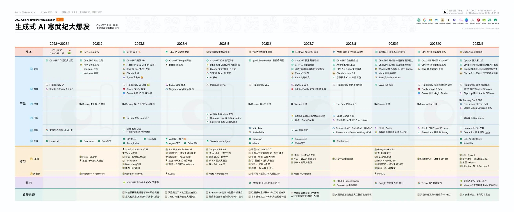
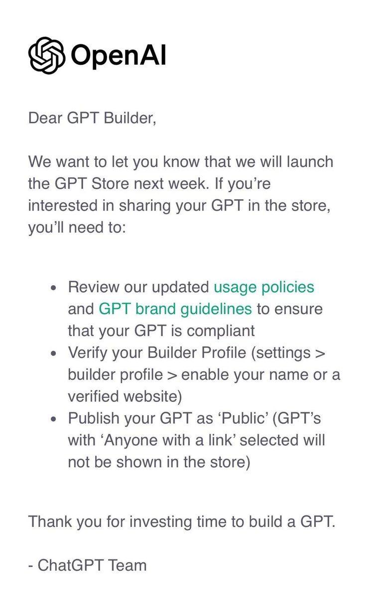

# AIToBox周刊：第 1 期

这里记录每周值得分享的AI科技内容，周末发布。

本杂志开源（GitHub: [aitobox/newsweekly](https://github.com/aitobox/newsweekly)），欢迎提交 issue，投稿或推荐你的项目。

## 2023， AI起飞的一年

2023 年是 AI 发展的关键一年，ChatGPT 以及 GPT-4 的发布引发了全社会对于大模型以及生成式 AI 的关注。

科技巨头微软、亚马逊、谷歌、Meta 等纷纷发力 AI；文本生成、文生图以及文生视频 AI 工具进展迅速；国内的“百模大战”；各国对于 AI 的监管逐渐加强；科学家们还在研究“涌现”的原理；还有年底的 OpenAI Drama 事件……

## AI资讯

#### 2023年50个访问量最大的AI工具及AI行业分析报告

Writerbuddy AI使用 SEO 行业著名的工具SEMrush，通过抓取AI工具数据，研究了3000多种 AI 工具。

从中选出了访问量最大的 50 个工具，这前 50 位的AI工具就产生了超过 240 亿次的访问量。

其中ChatGPT就独占了 140 亿流量，占分析流量的60%。

详细发现： 🧵↓

- AI行业平均每月增长2.363亿次访问量。分析的 50 个人工智能工具经历了 10.7 倍的增长率，平均每月访问量增加 2.363 亿次。

- 过去12个月中，AI应用每月平均访问量达到20亿次，过去6个月，每月平均访问量激增至33亿次。

- ChatGPT、Character AI和Google Bard的访问量分别净增长了18亿次、4.634亿次和6800万次。

- 访问量最高AI聊天机器人：ChatGPT处于绝对领先地位，占 AI 聊天机器人类别总访问量的 76.31%。紧随其后的是Character AI，以19.86%的访问量位居第二。

- Craiyon、MidJourney和Quillbot面临最大的流量下降。

- 美国贡献了55亿人次访问量，占总访问量的22.62%，而欧洲国家合计贡献了39亿人次访问量。

- AI 聊天机器人工具最受欢迎，访问量达到 191 亿次。

- 超过63%的AI工具用户通过移动设备访问。

- 存在性别差异，69.5%为男性用户，30.5%为女性用户。

原文请参考[这里](https://writerbuddy.ai/blog/ai-industry-analysis)

#### GPT Store 已经可以提交申请

## AI服务和工具

#### [AI Tube](https://jbilcke-hf-ai-tube.hf.space/)

AI Tube：首个AI视频平台。

该平台上的所有视频都是完全由人工智能生成。

AI Tube提供了多种类型的视频频道，包括音乐、动画、Minecraft、Lofi、教程、游戏、公共领域和烹饪等！目前看视频数量还比较有限！

#### [NeuralRad Cloud：史上首个免费使用的器官和肿瘤分割云服务](http://service.neuralrad.com/)

介绍 service.neuralrad.com ，这是第一个免费提供全身器官风险（ OAR ）和肿瘤分割的云平台，任何人都可以使用。

我们使用一系列高性能 GPU 服务器构建了这个云平台（其中大多数是 Nvidia Geforce 4090 和 3090 ），并且在任何特定时间动态分配超过 100GB 的 GPU 内存，以进行快速的基于深度学习的分割推断。

通过这项服务，我们希望帮助医学物理学家和医生解决放射治疗工作流程中令人困扰的病变和 OAR 分割问题。

附言：该平台已被国际原子能机构（ IAEA ）选定为 [IAEA 2023 年医学物理学人工智能研讨会项目](https://www.iaea.org/events/evt2304232)

免责声明：目前，NeuralRad 云服务尚未获得 FDA 批准。我们建议将此服务用于研究和学习目的。所有 DICOM 文件的患者信息都会在浏览器（客户端）端自动匿名化，只有匿名化的 DICOM 数据会被发送到 NeuralRad 云服务器进行分割推断。

[发布来源-v2ex](https://v2ex.com/t/1006501)

（完）
