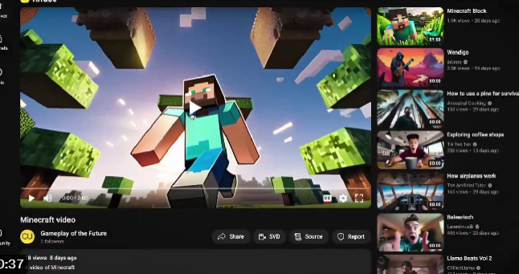

# AIToBox周刊：第 1 期

这里记录每周值得分享的AI科技内容，周末发布。

本杂志开源（GitHub: [aitobox/newsweekly](https://github.com/aitobox/newsweekly)），欢迎提交 issue，投稿或推荐你的项目。

## AI资讯

1、[GPT Store 已经可以提交申请]

## AI服务和工具

1、[AI Tube](https://jbilcke-hf-ai-tube.hf.space/)

AI Tube：首个AI视频平台。

该平台上的所有视频都是完全由人工智能生成。

AI Tube提供了多种类型的视频频道，包括音乐、动画、Minecraft、Lofi、教程、游戏、公共领域和烹饪等！目前看视频数量还比较有限！

2、[NeuralRad Cloud：史上首个免费使用的器官和肿瘤分割云服务](http://service.neuralrad.com/)

介绍 service.neuralrad.com ，这是第一个免费提供全身器官风险（ OAR ）和肿瘤分割的云平台，任何人都可以使用。

我们使用一系列高性能 GPU 服务器构建了这个云平台（其中大多数是 Nvidia Geforce 4090 和 3090 ），并且在任何特定时间动态分配超过 100GB 的 GPU 内存，以进行快速的基于深度学习的分割推断。

通过这项服务，我们希望帮助医学物理学家和医生解决放射治疗工作流程中令人困扰的病变和 OAR 分割问题。

附言：该平台已被国际原子能机构（ IAEA ）选定为 [IAEA 2023 年医学物理学人工智能研讨会项目](https://www.iaea.org/events/evt2304232)

免责声明：目前，NeuralRad 云服务尚未获得 FDA 批准。我们建议将此服务用于研究和学习目的。所有 DICOM 文件的患者信息都会在浏览器（客户端）端自动匿名化，只有匿名化的 DICOM 数据会被发送到 NeuralRad 云服务器进行分割推断。

[发布来源-v2ex](https://v2ex.com/t/1006501)

（完）
